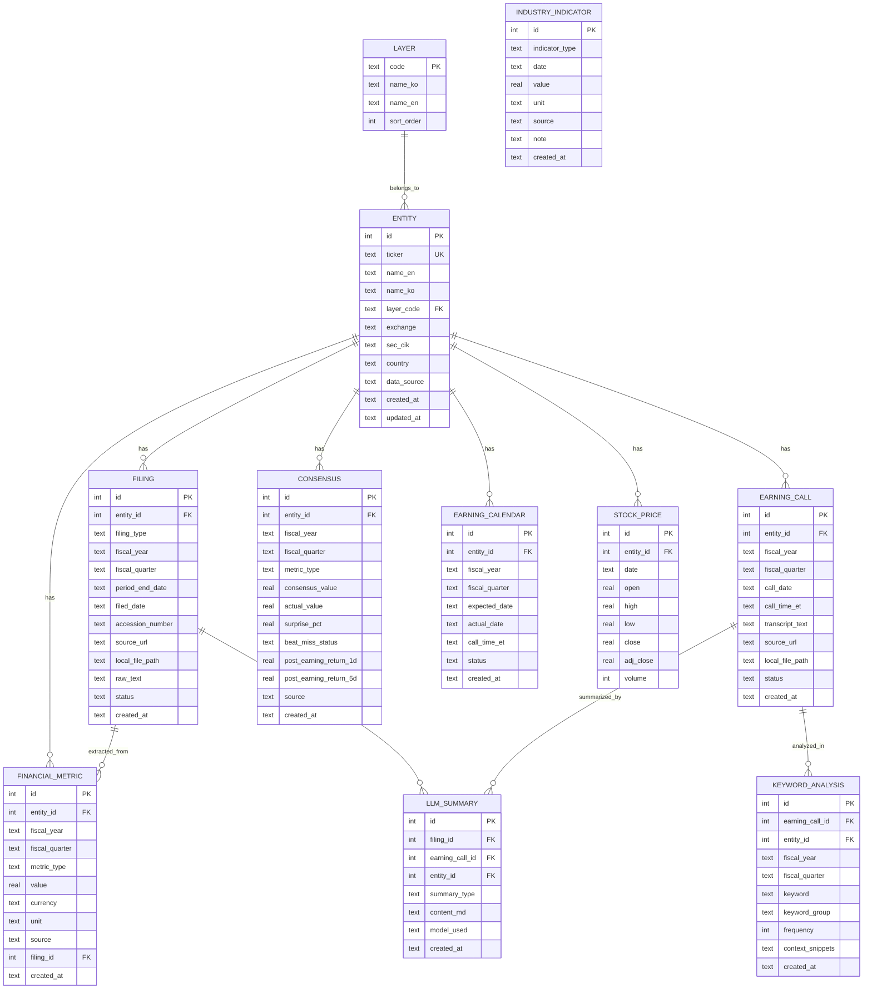
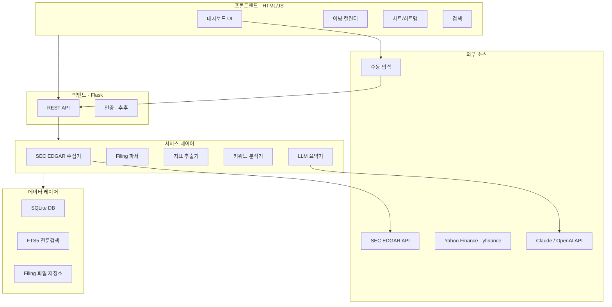

# 📋 요건정의서 (Requirements Specification)

> **프로젝트명**: QK_EARNING — 미국 주식 10-Q / 10-K / 어닝콜 관리 시스템  
> **작성일**: 2026-09-17  
> **버전**: v1.1 (추가 데이터 소스 반영)  
> **상태**: 초안

---

## 1. 프로젝트 개요

몇가지 추가 사항을 적음 아이패드에서 글을 쓰는 것이 좋은가. 그러면 어디에 쓰는 것이 좋은가...  내가 글을 쓰는 장소 (코드,옵시디안, 깊 메모?)

### 1.1 목적
미국 주식 핵심 기업 34개사의 분기/연간 보고서(10-Q, 10-K, 8-K), 어닝콜 트랜스크립트, 주가 데이터, 산업 선행지표를 **자동 수집·구조화·분석·인사이트 생성**까지 일관되게 관리하는 웹 애플리케이션을 구축한다.

### 1.2 핵심 가치
- **원스톱 관리**: 34개 기업의 SEC Filing과 어닝콜을 한곳에서 열람·비교
- **자동화**: SEC EDGAR API 기반 자동 수집 + 핵심 지표 자동 파싱
- **인사이트**: LLM 기반 요약, 키워드 분석, Beat/Miss 시각화로 빠른 투자 판단 지원

### 1.3 의사결정 요약

| 항목 | 결정 |
|------|------|
| 데이터 수집 | 자동 수집 기본 + 수동 추가 가능 |
| 기능 범위 | 저장/열람 + 구조화 + 분석 + 인사이트 (전체) |
| 비상장/해외 기업 | 유연 구조로 다양한 소스 수용 |
| DB | SQLite |
| 기술 스택 | HTML/JS + Python Flask (경량) |
| 사용 환경 | 로컬 우선, 추후 클라우드 배포 |
| 이전 프로젝트 | 완전 새로 시작 |
| 이력 범위 | 2020-Q1 ~ 현재 (26+ 분기) |
| 원본 문서 저장 | 혼합 (원본 파일 → 폴더, 파싱 텍스트 → DB) |

---

## 2. 대상 기업

### 2.1 레이어 구조 (8개 레이어 × 34개 기업)

| 레이어 | 코드 | 기업 수 | 기업명 |
|--------|------|---------|--------|
| 하이퍼스케일러 | L2_HYPERSCALER | 7 | Google (GOOGL), Amazon (AMZN), Microsoft (MSFT), Meta (META), Oracle (ORCL), CoreWeave (CRWV), Nebius (NBIS) |
| 컴퓨팅/가속기 | L3_COMPUTE | 5 | NVIDIA (NVDA), AMD (AMD), Broadcom (AVGO), Arm (ARM), Intel (INTC) |
| 파운드리/장비 | L4_FOUNDRY | 7 | TSMC (TSM), ASML (ASML), Applied Materials (AMAT), Lam Research (LRCX), KLA (KLAC), ASE (ASX), Amkor (AMKR) |
| 메모리/스토리지 | L5_MEMORY | 5 | SK Hynix (000660.KS), Samsung (005930.KS), Micron (MU), Western Digital (WDC), Kioxia (6600.T) |
| 광통신/네트워킹 | L6_OPTICAL | 3 | Marvell (MRVL), Coherent (COHR), Arista Networks (ANET) |
| 인프라/특수 | L7_INFRA | 3 | SpaceX/xAI (비상장), SoftBank (9984.T), Apple (AAPL) |
| 전력/에너지 | L8_POWER | 4 | Vertiv (VRT), Eaton (ETN), GE Vernova (GEV), Schneider Electric (SBGSF) |

### 2.2 기업별 데이터 소스 분류

| 분류 | 기업 | Filing 소스 | 비고 |
|------|------|-------------|------|
| **SEC 정규** | GOOGL, AMZN, MSFT, META, ORCL, NVDA, AMD, AVGO, ARM, INTC, AMAT, LRCX, KLAC, AMKR, MU, WDC, MRVL, COHR, ANET, AAPL, VRT, ETN, GEV | SEC EDGAR (10-Q, 10-K) | 자동 수집 |
| **SEC 외국기업** | TSM, ASML, ASX, SBGSF | SEC EDGAR (20-F, 6-K) | 10-Q 대신 6-K |
| **IPO 신규** | CRWV, NBIS | SEC EDGAR | 공시 이력 짧음 |
| **한국 상장** | SK하이닉스, 삼성전자 | DART (전자공시) | 수동 입력 또는 DART API |
| **일본 상장** | 키옥시아, 소프트뱅크 | 도쿄증권거래소 | 수동 입력 |
| **비상장** | SpaceX/xAI | 없음 | 뉴스/프레스릴리스 수동 입력 |

---

## 3. 기능 요건

### 3.1 핵심 기능 (1차 개발)

#### F1. 데이터 수집 엔진

| 항목 | 상세 |
|------|------|
| **SEC Filing 자동 수집** | SEC EDGAR API를 통해 10-Q, 10-K, **8-K**, 20-F, 6-K 자동 다운로드 |
| **8-K 수집** | Current Report 자동 수집 — M&A, 대형 수주, 가이던스 수정, 경영진 변경 등 분기 중 이벤트 포착 |
| **어닝콜 수집** | 어닝콜 트랜스크립트 수집 (소스: 8-K Exhibit 99.1 또는 외부 API) |
| **주가 데이터 수집** | yfinance API로 일간 OHLCV(시가/고가/저가/종가/거래량) 자동 수집 |
| **산업 선행지표 수집** | TSMC 월매출, 메모리 현물가(DRAM/NAND), 하이퍼스케일러 CapEx 집계 |
| **수동 입력** | 관리자가 직접 파일 업로드 (PDF, HTML, TXT) 또는 텍스트 붙여넣기 |
| **스케줄링** | 분기 실적 시즌(1/4/7/10월)에 자동 수집 배치 실행, 주가는 일간 수집 |
| **수집 상태 관리** | 기업별·데이터유형별 수집 현황 대시보드 (수집 완료/미수집/오류) |

#### F2. 어닝 캘린더

| 항목 | 상세 |
|------|------|
| **실적 발표일 관리** | 34개 기업의 분기별 실적 발표 예정일 표시 |
| **캘린더 뷰** | 월간/주간 캘린더에 발표일 시각화 |
| **카운트다운** | 다가오는 실적 발표까지 D-day 표시 |
| **컨퍼런스콜 시간** | 실적 발표일 + 콜 시간(ET) 표시 |
| **자동 업데이트** | 발표일 변경 시 자동 반영 (수동 수정도 가능) |

#### F3. 핵심 지표 자동 추출

| 항목 | 상세 |
|------|------|
| **추출 대상 지표** | 매출(Revenue), EPS, 영업이익률(OPM), Capex, 가이던스(다음 분기 매출/EPS 전망) |
| **파싱 방식** | 10-Q/10-K 내 Financial Statements 섹션에서 규칙 기반 추출 + LLM 보정 |
| **정규화** | 통화(USD/KRW/JPY/EUR) 통일, 단위(M/B/T) 통일 |
| **수동 보정** | 자동 추출 결과를 사용자가 검토·수정 가능 |
| **이력 관리** | 2020-Q1부터 분기별 시계열 데이터 축적 |

#### F4. Beat/Miss 대시보드

| 항목 | 상세 |
|------|------|
| **컨센서스 데이터** | 시장 컨센서스(매출/EPS) 수동 입력 또는 API 연동 |
| **판정 로직** | 실적 vs 컨센서스 비교 → Beat / In-line / Miss 자동 판정 |
| **시각화** | 기업별 Beat/Miss 히스토리 히트맵 (분기×기업 매트릭스) |
| **서프라이즈 %** | 실적 서프라이즈 비율(%) 표시 |
| **어닝 후 주가 반응** | 실적 발표 후 1일/5일 주가 수익률 자동 계산 (주가 데이터 연동) |
| **레이어별 집계** | 레이어 단위로 Beat/Miss 비율 집계 |

#### F5. 어닝콜 키워드 분석

| 항목 | 상세 |
|------|------|
| **키워드 사전** | 사전 정의 키워드 그룹: AI/ML, CapEx, Demand, Margin, Guidance, Inventory, China 등 |
| **빈도 분석** | 어닝콜 트랜스크립트 내 키워드 출현 빈도 카운트 |
| **트렌드** | 분기별 키워드 빈도 변화 추이 차트 |
| **컨텍스트** | 키워드 주변 문장(±2문장) 발췌하여 맥락 확인 |
| **커스텀 키워드** | 사용자가 키워드를 추가/삭제 가능 |

#### F6. 산업 선행지표 대시보드

| 항목 | 상세 |
|------|------|
| **TSMC 월간 매출** | TSMC IR 페이지에서 월매출 수집 — AI 칩(NVDA, AMD, AVGO) 수요 선행지표 |
| **메모리 현물가** | DRAM/NAND 스팟 가격 추이 (DRAMeXchange/TrendForce) — SK하이닉스, 삼성전자, 마이크론 실적 예측 |
| **하이퍼스케일러 CapEx 집계** | GOOGL, AMZN, MSFT, META의 분기별 CapEx를 자동 집계 — AI 인프라 투자 총량 추적 |
| **시각화** | 시계열 차트 + 밸류체인 레이어와 교차 분석 |
| **수집 방식** | TSMC 월매출: 반자동(IR 크롤링), 메모리 가격: 수동 입력, CapEx: financial_metric 자동 집계 |

### 3.2 기본 기능

#### F6. 문서 열람 및 검색

| 항목 | 상세 |
|------|------|
| **목록 뷰** | 기업별/분기별/문서유형별 Filing 목록 |
| **필터링** | 레이어, 기업, 분기, 문서유형(10-Q/10-K/어닝콜) 필터 |
| **전문 검색** | 파싱된 텍스트 대상 키워드 검색 (SQLite FTS5) |
| **원본 보기** | 원본 PDF/HTML 파일 링크 또는 인라인 뷰어 |
| **정렬** | 날짜순, 기업순, 레이어순 정렬 |

#### F7. 기업 프로필

| 항목 | 상세 |
|------|------|
| **기업 정보** | 티커, 정식명, 레이어, 상장시장, SEC CIK 번호 |
| **실적 요약** | 최근 4분기 핵심 지표 테이블 |
| **Filing 히스토리** | 해당 기업의 전체 Filing 목록 |
| **트렌드 차트** | 매출/EPS/마진 시계열 차트 |

#### F8. LLM 기반 인사이트

| 항목 | 상세 |
|------|------|
| **Filing 요약** | 10-Q/10-K 핵심 내용을 1페이지 마크다운으로 요약 |
| **어닝콜 요약** | 어닝콜 Q&A 핵심 포인트 추출 |
| **비교 리포트** | 같은 레이어 내 기업 간 실적 비교 자동 생성 |
| **LLM 선택** | Claude API 또는 OpenAI API 선택 가능 |

### 3.3 추후 개발 (2차)

| 기능 | 설명 | 비고 |
|------|------|------|
| S-1 IPO 문서 수집 | CoreWeave, Nebius 등 신규 상장사 IPO 문서 | SEC EDGAR |
| 컨센서스 히스토리 | 애널리스트 추정치의 시간별 변화 추이 | 수동 입력 |
| SEMI 장비 출하 데이터 | 글로벌 반도체 장비 Billing 통계 | SEMI.org |
| GPU 가격 추이 | H100/B200 등 시장 가격 추적 | 수동 입력 |
| 애널리스트 투자의견 변경 | Buy/Sell 변경, 목표가 수정 | 수동 입력 |
| 레이어별 크로스 비교 | 같은 레이어 기업 간 지표 비교 테이블 | 1차 데이터 축적 후 |
| 서플라이체인 연결 뷰 | L2→L3→L4→L5 공급망 관계 시각화 | 관계 데이터 정의 필요 |
| 알림 시스템 | 새 Filing 등록 시 Slack/이메일 알림 | 클라우드 배포 후 |
| 주석/메모 기능 | Filing별 사용자 코멘트 첨부 | |
| 내보내기 | 대시보드/테이블을 Excel/PDF로 내보내기 | |

---

## 4. 데이터베이스 설계

### 4.1 기술 선택
- **DBMS**: SQLite 3
- **전문 검색**: SQLite FTS5 확장 모듈
- **DB 파일 위치**: `data/qk_earning.db`
- **마이그레이션**: Python 스크립트 기반 스키마 버전 관리

### 4.2 ERD (Entity-Relationship)



### 4.3 주요 테이블 상세

#### `entity` — 기업 마스터

| 컬럼 | 타입 | 설명 |
|------|------|------|
| id | INTEGER PK | 자동 증가 |
| ticker | TEXT UNIQUE | 종목코드 (예: NVDA, 000660.KS) |
| name_en | TEXT | 영문명 |
| name_ko | TEXT | 한글명 |
| layer_code | TEXT FK | 레이어 코드 (L2_HYPERSCALER 등) |
| exchange | TEXT | 상장 거래소 (NYSE, NASDAQ, KRX, TSE 등) |
| sec_cik | TEXT | SEC CIK 번호 (해당 시) |
| country | TEXT | 국가 (US, KR, JP, NL 등) |
| data_source | TEXT | 주요 데이터 소스 (SEC, DART, TSE, MANUAL) |
| fiscal_year_end | TEXT | 회계연도 종료월 (12, 03 등) |

#### `filing` — SEC Filing / 공시 문서

| 컬럼 | 타입 | 설명 |
|------|------|------|
| id | INTEGER PK | 자동 증가 |
| entity_id | INTEGER FK | 기업 ID |
| filing_type | TEXT | 문서 유형 (10-Q, 10-K, 20-F, 6-K, DART_QUARTERLY 등) |
| fiscal_year | TEXT | 회계연도 (2024) |
| fiscal_quarter | TEXT | 분기 (Q1, Q2, Q3, Q4, FY) |
| period_end_date | TEXT | 보고 기간 종료일 |
| filed_date | TEXT | 제출일 |
| accession_number | TEXT | SEC Accession Number |
| source_url | TEXT | 원본 URL |
| local_file_path | TEXT | 로컬 저장 경로 |
| raw_text | TEXT | 파싱된 전문 텍스트 (FTS5 인덱싱 대상) |
| status | TEXT | 상태 (DOWNLOADED, PARSED, REVIEWED, ERROR) |

#### `financial_metric` — 핵심 재무지표

| 컬럼 | 타입 | 설명 |
|------|------|------|
| id | INTEGER PK | 자동 증가 |
| entity_id | INTEGER FK | 기업 ID |
| fiscal_year | TEXT | 회계연도 |
| fiscal_quarter | TEXT | 분기 |
| metric_type | TEXT | 지표 유형 (revenue, eps, op_margin_pct, capex, guidance_revenue_next_q 등) |
| value | REAL | 값 |
| currency | TEXT | 통화 (USD, KRW, JPY, EUR) |
| unit | TEXT | 단위 (M=백만, B=십억, T=조, pct=%) |
| source | TEXT | 추출 소스 (AUTO, MANUAL, LLM) |
| filing_id | INTEGER FK | 원본 Filing ID |

#### `consensus` — 컨센서스 및 Beat/Miss

| 컬럼 | 타입 | 설명 |
|------|------|------|
| id | INTEGER PK | 자동 증가 |
| entity_id | INTEGER FK | 기업 ID |
| fiscal_year | TEXT | 회계연도 |
| fiscal_quarter | TEXT | 분기 |
| metric_type | TEXT | 지표 유형 (revenue, eps) |
| consensus_value | REAL | 컨센서스 값 |
| actual_value | REAL | 실제 값 |
| surprise_pct | REAL | 서프라이즈 비율 (%) |
| beat_miss_status | TEXT | 판정 (BEAT, INLINE, MISS) |
| post_earning_return_1d | REAL | 실적 발표 후 1일 주가 수익률 (%) |
| post_earning_return_5d | REAL | 실적 발표 후 5일 주가 수익률 (%) |

#### `stock_price` — 일간 주가 데이터

| 컬럼 | 타입 | 설명 |
|------|------|------|
| id | INTEGER PK | 자동 증가 |
| entity_id | INTEGER FK | 기업 ID |
| date | TEXT | 거래일 (YYYY-MM-DD) |
| open | REAL | 시가 |
| high | REAL | 고가 |
| low | REAL | 저가 |
| close | REAL | 종가 |
| adj_close | REAL | 수정 종가 |
| volume | INTEGER | 거래량 |

#### `industry_indicator` — 산업 선행지표

| 컬럼 | 타입 | 설명 |
|------|------|------|
| id | INTEGER PK | 자동 증가 |
| indicator_type | TEXT | 지표 유형 (TSMC_MONTHLY_REV, DRAM_SPOT, NAND_SPOT, SEMI_BILLING, HYPERSCALER_CAPEX, **KR_SEMI_EXPORT_AMT**, **KR_SEMI_EXPORT_YOY**, **KR_TOTAL_EXPORT_AMT**) |
| date | TEXT | 날짜 (YYYY-MM-DD) |
| value | REAL | 값 |
| unit | TEXT | 단위 (M_USD, USD_per_GB 등) |
| source | TEXT | 출처 (TSMC_IR, TRENDFORCE, SEMI, CALCULATED) |
| note | TEXT | 비고 |

---

## 5. 시스템 아키텍처

### 5.1 기술 스택

| 계층 | 기술 | 비고 |
|------|------|------|
| **프론트엔드** | HTML5 + Vanilla JS + CSS3 | 경량, 프레임워크 없음 |
| **차트** | Chart.js 또는 ApexCharts | 트렌드/히트맵 시각화 |
| **백엔드** | Python 3.11+ / Flask | REST API 서버 |
| **DB** | SQLite 3 + FTS5 | 전문 검색 지원 |
| **SEC 수집** | SEC EDGAR API + Python requests | Filing 자동 수집 |
| **주가 수집** | yfinance (Yahoo Finance) | 일간 OHLCV 자동 수집 |
| **LLM** | Claude API / OpenAI API | 요약 및 인사이트 |
| **배포 (추후)** | Docker + Nginx | 클라우드 배포 대비 |

### 5.2 디렉토리 구조

```
b_0917_10_QK_EARNING/
├── app/                          # Flask 앱
│   ├── __init__.py
│   ├── routes/                   # API 라우트
│   │   ├── entities.py           # 기업 관련 API
│   │   ├── filings.py            # Filing 관련 API
│   │   ├── earnings.py           # 어닝콜 관련 API
│   │   ├── metrics.py            # 재무지표 API
│   │   ├── calendar.py           # 어닝 캘린더 API
│   │   ├── analysis.py           # 분석/키워드 API
│   │   └── llm.py                # LLM 요약 API
│   ├── models/                   # DB 모델
│   │   └── database.py
│   ├── services/                 # 비즈니스 로직
│   │   ├── edgar_collector.py    # SEC EDGAR 수집기
│   │   ├── filing_parser.py      # Filing 파싱
│   │   ├── metric_extractor.py   # 지표 추출
│   │   ├── price_collector.py    # 주가 데이터 수집 (yfinance)
│   │   ├── indicator_collector.py # 산업 선행지표 수집
│   │   ├── keyword_analyzer.py   # 키워드 분석
│   │   └── llm_summarizer.py     # LLM 요약
│   └── config.py                 # 설정
├── static/                       # 프론트엔드
│   ├── css/
│   │   └── style.css
│   ├── js/
│   │   ├── app.js                # 메인 앱
│   │   ├── dashboard.js          # 대시보드
│   │   ├── calendar.js           # 캘린더
│   │   ├── charts.js             # 차트 유틸
│   │   └── search.js             # 검색
│   └── index.html
├── data/                         # 데이터
│   ├── qk_earning.db             # SQLite DB
│   └── filings/                  # 원본 Filing 파일
│       ├── 10-Q/
│       ├── 10-K/
│       ├── 8-K/
│       ├── 20-F/
│       ├── 6-K/
│       └── earning_calls/
├── scripts/                      # 유틸리티 스크립트
│   ├── init_db.py                # DB 초기화
│   ├── seed_entities.py          # 기업 마스터 데이터 시딩
│   ├── collect_filings.py        # Filing 수집 배치
│   └── collect_earning_calls.py  # 어닝콜 수집 배치
├── docs/                         # 문서
│   ├── 2026-09-17_요건정의서.md   # 본 문서
│   └── api_spec.md               # API 스펙
├── tests/                        # 테스트
├── requirements.txt
├── human.md                      # 원본 요구사항
├── ask.md                        # Q&A
└── README.md
```

### 5.3 아키텍처 다이어그램



---

## 6. 화면 구성

### 6.1 페이지 목록

| # | 페이지 | URL | 설명 |
|---|--------|-----|------|
| 1 | **대시보드** | `/` | 전체 현황 요약, 최근 Filing, 다가오는 실적 발표 |
| 2 | **어닝 캘린더** | `/calendar` | 월간/주간 실적 발표일 캘린더 |
| 3 | **기업 목록** | `/entities` | 레이어별 기업 카드/테이블 뷰 |
| 4 | **기업 상세** | `/entities/<ticker>` | 기업 프로필 + 실적 히스토리 + 주가 차트 |
| 5 | **Filing 목록** | `/filings` | 전체 Filing 목록 (필터/검색, 8-K 포함) |
| 6 | **Filing 상세** | `/filings/<id>` | Filing 원문 + 추출 지표 + LLM 요약 |
| 7 | **Beat/Miss** | `/beat-miss` | Beat/Miss 히트맵 + 어닝 후 주가 반응 |
| 8 | **키워드 분석** | `/keywords` | 어닝콜 키워드 빈도 트렌드 |
| 9 | **산업 선행지표** | `/indicators` | TSMC 월매출, 메모리 현물가, CapEx 집계 |
| 10 | **수집 관리** | `/admin/collect` | 데이터 수집 현황 및 수동 트리거 |
| 11 | **수동 입력** | `/admin/upload` | Filing/어닝콜/선행지표 수동 업로드 |

### 6.2 대시보드 와이어프레임 (메인 페이지)

```
+-------------------------------------------------------------+
|  QK EARNING                          검색       설정         |
+-----------+-----------+-----------+-----------+--------------+
|  34       |  1,247    |  89%      |  D-3      |              |
|  기업     |  Filing   |  Beat율   |  다음실적 |              |
+-----------+-----------+-----------+-----------+--------------+
|                                                              |
|  --- 다가오는 실적 발표 -----------------------------------  |
|  D-3  NVDA  2026-Q3  |  D-7  GOOGL 2026-Q3                  |
|  D-12 AMZN  2026-Q3  |  D-14 META  2026-Q3                  |
|  -----------------------------------------------------------  |
|                                                              |
|  --- 최근 등록 Filing -----  --- Beat/Miss ----------------  |
|  NVDA  10-Q  2026-Q2  Beat  |  Beat  /  Miss                |
|  TSMC  6-K   2026-Q2  Beat  |  L2 ========--  80%           |
|  AMZN  10-Q  2026-Q2  Inln  |  L3 ==========  100%         |
|  MU    10-Q  2026-Q2  Miss  |  L4 =======---  70%           |
|  ----------------------------  ----------------------------  |
|                                                              |
|  --- 어닝콜 키워드 트렌드 --------------------------------  |
|  "AI"  /\/\/\/\/\     |  "CapEx" /\/\/\/\                    |
|  "Demand" /\/\/\      |  "Margin" /\/\/                      |
|  -----------------------------------------------------------  |
+--------------------------------------------------------------+
```

---

## 7. API 설계 (주요 엔드포인트)

| Method | Endpoint | 설명 |
|--------|----------|------|
| GET | `/api/entities` | 기업 목록 (필터: layer_code) |
| GET | `/api/entities/<ticker>` | 기업 상세 |
| GET | `/api/filings` | Filing 목록 (필터: entity_id, type, quarter) — 8-K 포함 |
| GET | `/api/filings/<id>` | Filing 상세 + 추출 지표 |
| POST | `/api/filings/upload` | Filing 수동 업로드 |
| GET | `/api/earning-calls` | 어닝콜 목록 |
| GET | `/api/earning-calls/<id>` | 어닝콜 상세 + 키워드 분석 |
| GET | `/api/metrics/<ticker>` | 기업별 재무지표 시계열 |
| GET | `/api/prices/<ticker>` | 기업별 주가 데이터 (기간 필터) |
| GET | `/api/consensus` | Beat/Miss + 어닝 후 주가 반응 |
| GET | `/api/calendar` | 어닝 캘린더 |
| POST | `/api/calendar` | 일정 수동 등록/수정 |
| GET | `/api/keywords` | 키워드 분석 결과 |
| GET | `/api/indicators` | 산업 선행지표 조회 (타입/기간 필터) |
| POST | `/api/indicators` | 산업 선행지표 수동 입력 |
| POST | `/api/collect/trigger` | 수집 수동 트리거 (Filing/주가/지표 선택) |
| GET | `/api/collect/status` | 수집 상태 조회 |
| POST | `/api/llm/summarize/<filing_id>` | LLM 요약 생성 |
| GET | `/api/search?q=` | 전문 검색 |

---

## 8. 개발 로드맵

### Phase 1 — 기반 구축 (1~2주)
- [ ] 프로젝트 구조 셋업 (Flask + SQLite)
- [ ] DB 스키마 생성 (11개 테이블) + 기업 마스터 시딩
- [ ] 기업 목록/상세 페이지 (프론트 + API)
- [ ] SEC EDGAR 수집 엔진 (10-Q, 10-K, 8-K)
- [ ] 주가 데이터 수집 (yfinance)

### Phase 2 — 핵심 기능 (2~3주)
- [ ] Filing 파싱 + 핵심 지표 자동 추출
- [ ] 어닝콜 트랜스크립트 수집
- [ ] 어닝 캘린더
- [ ] Beat/Miss 대시보드 + 어닝 후 주가 반응
- [ ] 산업 선행지표 수집/입력 (TSMC 월매출, 메모리 현물가)

### Phase 3 — 분석/인사이트 (2~3주)
- [ ] 어닝콜 키워드 분석
- [ ] 산업 선행지표 대시보드 + 밸류체인 교차 분석
- [ ] LLM 기반 요약 생성
- [ ] 대시보드 통합 (메인 페이지)
- [ ] 전문 검색 (FTS5)

### Phase 4 — 고도화 (추후)
- [ ] 레이어별 크로스 비교
- [ ] 서플라이체인 연결 뷰
- [ ] S-1 IPO 문서, SEMI 데이터, GPU 가격 등 2차 데이터
- [ ] 클라우드 배포 (Docker)
- [ ] 알림 시스템

---

## 9. 비기능 요건

| 항목 | 요건 |
|------|------|
| **성능** | 34개 기업 x 26분기 = ~884건 Filing + 어닝콜 처리 가능 |
| **검색 응답** | FTS5 전문 검색 1초 이내 |
| **가용성** | 로컬 실행 기준, 단일 사용자 |
| **보안** | 로컬 전용 (추후 배포 시 인증 추가) |
| **데이터 백업** | SQLite DB 파일 + Filing 폴더 단위 백업 |
| **확장성** | 기업 추가 시 entity 테이블에 레코드만 추가 |
| **브라우저 호환** | Chrome, Safari, Firefox 최신 버전 |

---

## 10. 제약 사항 및 리스크

| # | 리스크 | 영향도 | 대응 방안 |
|---|--------|--------|-----------|
| 1 | SEC EDGAR API Rate Limit (초당 10건) | 중 | 배치 수집 시 딜레이 적용, 캐싱 |
| 2 | 어닝콜 트랜스크립트 공개 소스 제한 | 고 | 8-K Exhibit 활용 + 수동 입력 대안 |
| 3 | 비상장 기업 데이터 부재 | 중 | 수동 입력으로 대체, 해당 필드 nullable |
| 4 | LLM API 비용 | 중 | 요약 생성은 온디맨드, 캐싱하여 중복 호출 방지 |
| 5 | 해외 기업 Filing 형식 차이 | 중 | filing_type 필드로 유형 구분, 파서 분기 처리 |
| 6 | 회계연도 차이 (예: Apple 9월, 삼성 12월) | 저 | fiscal_year_end 필드로 기업별 관리 |

---

## 부록: 용어 정의

| 용어 | 설명 |
|------|------|
| **10-Q** | 분기 보고서 (SEC에 제출하는 미국 상장사 분기 재무보고서) |
| **10-K** | 연간 보고서 (SEC에 제출하는 미국 상장사 연간 재무보고서) |
| **20-F** | 외국 기업 연간 보고서 (SEC에 제출) |
| **6-K** | 외국 기업 수시 보고서 (SEC에 제출, 분기 실적 포함) |
| **어닝콜** | 실적 발표 후 진행하는 컨퍼런스콜 (경영진 발표 + 애널리스트 Q&A) |
| **Beat/Miss** | 실적이 시장 컨센서스를 상회(Beat)/하회(Miss)한 여부 |
| **CIK** | Central Index Key, SEC가 기업에 부여하는 고유번호 |
| **FTS5** | SQLite의 Full-Text Search 확장 모듈 |
| **DART** | 한국 전자공시시스템 (금융감독원) |
| **8-K** | Current Report, 중요 사건 발생 시 즉시 제출하는 SEC 보고서 |
| **OHLCV** | Open/High/Low/Close/Volume, 일간 주가 데이터 구성 요소 |
| **yfinance** | Yahoo Finance 데이터를 Python으로 가져오는 오픈소스 라이브러리 |
| **DRAMeXchange** | DRAM/NAND 메모리 현물가격 제공 서비스 (TrendForce 산하) |
