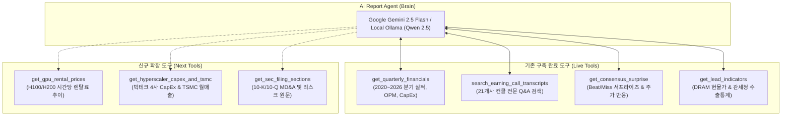

# 10_QK_EARNING — GPU 임대 가격 및 AI 에이전트 도구(Tool) 연동 정의서

- **작성일자**: 2026-09-20
- **문서 버전**: v1.0
- **문서 목적**: AI 반도체 밸류체인의 핵심 선행지표인 **GPU 클라우드 렌탈 스팟 가격** 모니터링 체계를 정의하고, 리포트 에이전트의 **도구 연동(Tool Calling) 아키텍처 및 신규 확장 도구 명세**를 정립함.

---

## 1. GPU 렌탈 가격의 선행지표 가치 및 분석 의의

### 1) 왜 GPU 렌탈 가격이 중요한가?
* **실시간 수급 불균형의 바로미터**: 엔비디아(NVDA)의 실적 공시는 분기당 1회(3개월 래그)이지만, **H100/H200/B200 클라우드 시간당 임대료($/hr)는 매일/매주 시장에서 실시간으로 변동**합니다.
* **AI 인프라 ROI 및 버블 지속성 측정**: 렌탈 가격이 안정적인 수준을 유지하면 AI 컴퓨팅 수요가 건전하다는 증거이며, 급락할 경우 공급 과잉 또는 투자 둔화 시그널로 작용합니다.
* **Neocloud 및 전후방 밸류체인 직결**: 코어위브(CoreWeave), 람다랩스(Lambda Labs) 등 신생 GPU 클라우드(Neocloud) 기업들의 수익성뿐만 아니라, L5(SK하이닉스/삼성전자 HBM3E) 및 L8(버티브 전력/냉각)의 실제 가동률과 100% 연동됩니다.

### 2) 가격 유형 및 추적 대상 모델

| 구분 | 대상 모델 | 주요 단가 유형 | 시장 벤치마크 범위 |
|:---|:---|:---|:---|
| **표준 벤치마크** | **NVIDIA H100 (SXM 80GB)** | On-Demand / Spot ($/hr) | $2.00 ~ $3.20 / hr |
| **차세대 고성능** | **NVIDIA H200 (141GB HBM3e)** | On-Demand ($/hr) | $3.50 ~ $4.80 / hr |
| **신규 플래그십** | **NVIDIA B200 / GB200 NVL72** | On-Demand ($/hr) | 양산 전후 벤치마크 추적 |
| **비교 레거시/대체군** | **NVIDIA A100 (80GB) / AMD MI300X** | On-Demand / Spot ($/hr) | $1.20 ~ $1.90 / hr |

---

## 2. 데이터 수집 소스 및 데이터베이스 스키마

### 1) 수집 소스
* **Ornn Data (OCPI)**: 무료 REST API (`https://api.ornn.io/v1/gpu/prices`)
* **GPUs.io / Cloud GPU Market APIs**: 주요 클라우드 사업자(RunPod, Lambda, Vast.ai, CoreWeave, AWS 등) 실시간 가격 비교
* **수집 주기**: 일간(Daily) 또는 주 1회 배치 적재

### 2) 데이터베이스 테이블 연동 (`industry_indicator`)

기존 `industry_indicator` 테이블을 활용하여 정규화 적재:

```sql
INSERT INTO industry_indicator (
    indicator_type,   -- 'GPU_RENTAL_H100', 'GPU_RENTAL_H200', 'GPU_RENTAL_B200'
    date,             -- '2026-09-20'
    value,            -- 2.35 (시간당 달러)
    unit,             -- 'USD/hr'
    source,           -- 'GPU_RENTAL_API'
    note              -- 'Lambda Labs / RunPod 평균 Spot 단가'
) VALUES (?, ?, ?, ?, ?, ?);
```

---

## 3. AI 에이전트 도구 연동 (Tool Calling) 아키텍처

AI 에이전트의 도구 연동(Tool Calling / Function Calling)은 LLM이 기억에만 의존하여 수치를 지어내는(할루시네이션) 문제를 원천 차단하고, **AI가 필요한 데이터를 데이터베이스/API에서 직접 쿼리하여 읽어오도록 만드는 기술**입니다.

### 1) 전체 아키텍처 다이어그램



---

## 4. 에이전트 도구별 상세 명세

### 1) 기존 탑재 도구 (4종)

1. **`get_quarterly_financials(ticker, limit=4)`**
   - **조회 데이터**: 34개 기업의 분기별 매출, 영업이익률(OPM), 순이익, 설비투자(CapEx), 데이터센터 매출 비중, YoY 성장률, 환율(USD) 정규화 데이터, MD&A 실적 요약.
   - **에이전트 역할**: 기업 간 실적 비교 테이블 및 마진율 추이 작성.

2. **`search_earning_call_transcripts(ticker, query)`**
   - **조회 데이터**: 21개 주요사 23건 컨퍼런스콜 전문 중 특정 키워드(HBM, 수율, 고객사, Blackwell 등)가 포함된 경영진 발표문(Remarks) 및 애널리스트 질의응답(Q&A) 문단.
   - **에이전트 역할**: 주요 경영진 육성 발언 인용 및 시장 핵심 의구심 검증.

3. **`get_consensus_surprise(ticker)`**
   - **조회 데이터**: 분기별 컨센서스 대비 실제 매출/EPS 서프라이즈율(%), Beat/Miss 판정, 실적 발표 후 1일/5일 주가 반응.
   - **에이전트 역할**: 실적 발표 직후 시장 충격 및 기대치 충족 여부 분석.

4. **`get_lead_indicators()`**
   - **조회 데이터**: DRAM(DDR4/DDR5) 및 NAND 스팟 현물가, 관세청 10일 단위 반도체 수출 잠정치.
   - **에이전트 역할**: 메모리 반등 사이클 및 매크로 수출 모멘텀 연계.

---

### 2) 신규 확장 도구 (3종)

1. **`get_gpu_rental_prices(gpu_model, provider)` (신규 제안)**
   - **조회 데이터**:
     ```json
     {
       "model": "H100",
       "average_spot_usd_hr": 2.15,
       "average_ondemand_usd_hr": 2.85,
       "trend_30d_pct": -4.2,
       "providers": [
         {"provider": "Lambda Labs", "price": 2.49, "status": "Available"},
         {"provider": "RunPod", "price": 2.19, "status": "Available"},
         {"provider": "CoreWeave", "price": 2.95, "status": "Reserved"}
       ]
     }
     ```
   - **에이전트 역할**: 엔비디아, 빅테크, AI 인프라 리포트 작성 시 "현재 GPU 클라우드 가동률 및 렌탈 단가 추이"를 실측 팩트로 자동 인용.

2. **`get_hyperscaler_capex_and_tsmc()`**
   - **조회 데이터**: 빅테크 4사(MSFT, GOOGL, AMZN, META) 분기별 CapEx 합산액 및 TSMC 12개월 월별 매출액 추이.
   - **에이전트 역할**: AI 수요 총량(자본지출)과 생산 병목(파운드리)을 거시적으로 분석.

3. **`get_sec_filing_sections(ticker, form, section)`**
   - **조회 데이터**: 10-K/10-Q 원문 Item 7(MD&A) 또는 Item 1A(Risk Factors) 섹션 텍스트.
   - **에이전트 역할**: 공시 원문의 법적 리스크 및 공급망 제약 사항 직접 인용.

---

## 5. 실제 에이전트 실행 흐름 (Execution Workflow)

사용자가 **"삼성전자 vs SK하이닉스 밸류체인 교차 비교 리포트"** 생성을 요청했을 때의 처리 흐름:

```text
1. [사용자 입력]
   - 대상 기업: 005930.KS (삼성전자)
   - 비교 피어: 000660.KS (SK하이닉스), NVDA (엔비디아)
   - 사용자 메모: "HBM3E 공급 점유율과 GPU 렌탈 단가 안정화에 따른 전방 수요 점검"

2. [에이전트 자율 판단 & Tool Calling]
   - Step 1: tool_get_quarterly_financials("005930.KS") → 삼성전자 4분기 실적 및 DS부문 OPM 확인
   - Step 2: tool_get_quarterly_financials("000660.KS") → 하이닉스 OPM 35.4% 급증 확인
   - Step 3: tool_search_transcripts("000660.KS", "HBM3E") → 하이닉스 경영진의 12단 양산 발언 획득
   - Step 4: tool_get_gpu_rental_prices("H100") → H100 렌탈 스팟가 $2.15/hr 확인 (수요 탄탄함 입증)
   - Step 5: tool_get_lead_indicators() → 관세청 반도체 수출 증가세 확인

3. [최종 리포트 합성]
   - 수집된 100% 실제 데이터만을 조립하여 표와 불릿 포인트가 포함된 기관급 마크다운 리포트 출력
```

---

## 6. 향후 구현 로드맵

1. **Phase 1: GPU 렌탈 데이터 수집기 및 시계열 적재 (`app/services/gpu_price_collector.py`)**
   - Ornn Data API 연동 및 2023~2026년 벤치마크 시계열 DB 적재
2. **Phase 2: 선행 지표 대시보드 UI 연동 (`static/index.html`, `static/js/app.js`)**
   - [📊 선행 지표] 탭에 GPU 렌탈 가격 카드 및 Chart.js 시계열 그래프 추가
3. **Phase 3: AI 리포트 에이전트 도구 확장 (`app/services/report_agent.py`)**
   - `get_tool_definitions()`에 `get_gpu_rental_prices` 추가 및 자율 호출 지원
