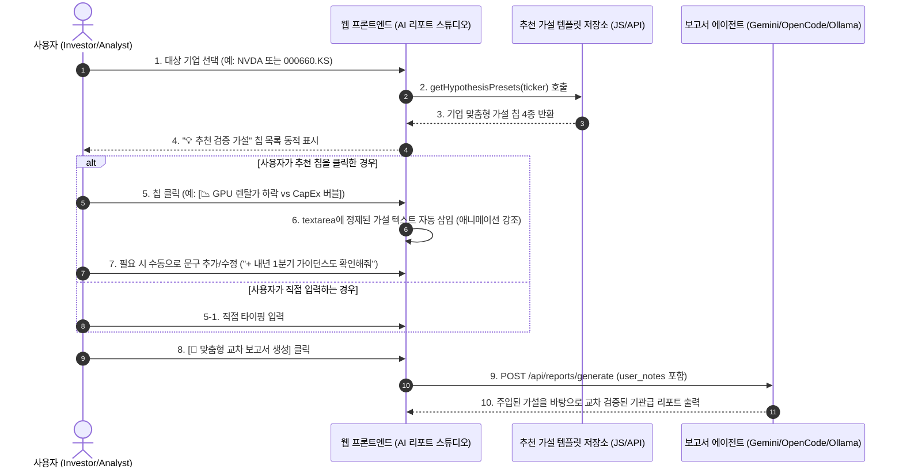

# 10_QK_EARNING — 검증 가설 추천 시스템 요건정의서 (SRS)

- **작성일자**: 2026-09-20
- **문서 버전**: v1.0
- **문서 상태**: 승인 대기 (Approved Pending)
- **대상 기능**: AI 리포트 스튜디오 — **「내 수동 메모 및 검증 가설」 추천 및 스마트 자동 완성 시스템**

---

## 1. 프로젝트 배경 및 목적

### 1) 배경 (Background)
* 현재 구축된 **AI 맞춤형 교차 리포트 에이전트 스튜디오**는 사용자 맞춤 분석을 위해 `[✍️ 내 수동 메모 및 검증 가설]` 입력창(`textarea`)을 제공하고 있음.
* 그러나 사용자가 매번 긴 검증 가설(예: *"HBM3E 공급 지연 이슈에 따른 SK하이닉스 독점 상황과 엔비디아 코멘트 대조"*, *"빅4 CapEx 대비 GPU 렌탈 스팟 가격 하락이 버블 신호인지 검증"*)을 일일이 타이핑해야 하므로 **작성 피로도 및 조작 번거로움**이 큼.
* 기관 투자자 및 전문 애널리스트 수준의 정밀한 가설을 비전문가나 바쁜 사용자가 즉시 떠올리기 어려움.

### 2) 목적 (Objective)
* **원클릭 가설 추천 (Quick Presets)**: 시장의 핵심 밸류체인 의문점을 원클릭 칩(태그) 형태로 제공하여 클릭 한 번으로 메모창에 자동 완성.
* **기업 맞춤형 스마트 추천 (Ticker-Contextual Presets)**: 대상 기업(NVDA, 000660.KS, 005930.KS, TSM 등)을 변경할 때마다 해당 기업의 핵심 현안과 병목 지표에 특화된 추천 가설을 동적으로 제안.
* **수동 수정 및 결합의 자유도 보장**: 추천받은 문구를 기초로 사용자가 본인의 관점을 덧붙이거나 수정할 수 있도록 유연한 편집 워크플로우 제공.
* **AI 리포트 품질 극대화**: 에이전트가 모호한 일반론 대신 **시장 최전선의 날카로운 검증 가설**을 바탕으로 SEC 10-K/Q, 관세청 수출, GPU 렌탈가를 교차 분석하도록 유도.

---

## 2. 시스템 요구사항 (System Requirements)

### 1) 기능 요구사항 (Functional Requirements)

| 요구사항 ID | 요구사항 명칭 | 상세 설명 | 중요도 |
|:---|:---|:---|:---:|
| **FR-01** | **원클릭 글로벌 핵심 가설 칩 제공** | AI 반도체/클라우드 시장의 5대 매크로 테마(HBM 공급망, GPU 렌탈가 하락 vs CapEx 버블, 관세청 수출 선행성, 차세대 패키징 병목, 파운드리 수율)를 클릭 가능한 칩 버튼으로 제공. | **필수 (P0)** |
| **FR-02** | **기업별 동적 맞춤 추천 연동** | 좌측 패널에서 대상 기업(Ticker)을 변경하면, 해당 기업에 특화된 3~4개의 핵심 검증 질문이 추천 칩으로 즉시 교체 렌더링됨. | **필수 (P0)** |
| **FR-03** | **입력 모드 지원 (대체 vs 덧붙이기)** | 추천 칩 클릭 시 기존 텍스트를 완전히 덮어쓰거나(Replace), 기존 메모 뒤에 줄바꿈으로 추가(Append)할 수 있는 모드 토글 또는 스마트 처리 지원. | **중요 (P1)** |
| **FR-04** | **원클릭 초기화 (Clear) 버튼** | 입력된 메모를 클릭 한 번으로 깔끔하게 비울 수 있는 초기화(`지우기`) 버튼 제공. | **보통 (P2)** |
| **FR-05** | **실시간 시장 지표 기반 스마트 가설 생성** | 대상 기업의 최신 분기 어닝 서프라이즈(Beat/Miss), 관세청 수출 YoY, GPU 렌탈가 추세를 조합하여 최신 시장 의문점을 룰 기반/AI 기반으로 1초 내에 동적 생성하는 API/기능. | **중요 (P1)** |
| **FR-06** | **에이전트 프롬프트 바인딩 보장** | 추천 및 편집된 메모 텍스트가 AI 리포트 생성 API(`POST /api/reports/generate`)의 `user_notes` 필드로 완벽히 전달되어, 최종 보고서의 [결론 및 리스크 평가] 챕터에 필수 반영되도록 보장. | **필수 (P0)** |

---

### 2) 비기능 요구사항 (Non-Functional Requirements)

| 요구사항 ID | 구분 | 상세 기준 |
|:---|:---|:---|
| **NFR-01** | **반응 속도** | 추천 칩 클릭 시 입력창 반영 시간 **50ms 미만** (순수 클라이언트 JavaScript 즉시 삽입). 기업 변경에 따른 칩 갱신 속도 30ms 미만. |
| **NFR-02** | **오프라인/로컬 구동** | 핵심 프리셋 사전(Dictionary)을 로컬에 내장하여 외부 네트워크 장애나 API 키 오류 상태에서도 100% 정상 작동. |
| **NFR-03** | **UI/UX 일관성** | 다크 모드 기반 글래스모피즘 디자인 시스템을 준수하고, 칩 호버/액티브 애니메이션 및 태그 배지를 적용하여 시각적 완성도 확보. |
| **NFR-04** | **유연성 및 안전성** | 텍스트 길이 제한(최대 2,000자)을 두며, XSS 등 악성 스크립트 인젝션 차단을 위한 이스케이프 처리. |

---

## 3. 상세 요건 명세 (Functional Specifications)

### 1) 사용자 인터랙션 흐름도 (User Interaction Flow)



---

### 2) 기업별 맞춤 가설 프리셋 매트릭스 (Ticker x Hypothesis Matrix)

| 대상 기업 (Ticker) | 추천 칩 라벨 | 추천 상세 가설 텍스트 (Textarea 삽입 내용) | 연계 분석 도구 |
|:---|:---|:---|:---|
| **NVDA**<br>(엔비디아) | **[📉 GPU 렌탈가 하락 vs CapEx 버블]** | "빅테크 4사(MSFT/GOOGL/AMZN/META)의 합산 CapEx 증가율 대비 최근 H100/H200 렌탈 스팟 가격 하락 추세가 AI 인프라 과잉 투자(버블론) 징후인지, 단기 공급 해소인지 교차 검증해 줘." | `get_gpu_rental_prices`<br>`get_quarterly_financials` |
| | **[⚙️ 블랙웰 패키징 병목 & 마진]** | "차세대 블랙웰(B200/GB200) 양산 램프업과 TSMC CoWoS 패키징 공급 부족이 이번 분기 데이터센터 매출총이익률(Gross Margin) 방어에 미칠 영향을 분석해 줘." | `search_earning_call_transcripts` |
| | **[🚢 관세청 수출과 데이터센터 시차]** | "한국 관세청 10일 반도체(메모리) 수출 증가율 추세와 엔비디아의 데이터센터 매출 성장률 사이의 선행/동행 시차 관계를 점검해 줘." | `get_lead_indicators` |
| **000660.KS**<br>(SK하이닉스) | **[🔥 HBM3E 독점력 & 수율 점검]** | "엔비디아향 HBM3E 8단/12단 공급 독점 지속 기간과 삼성전자의 퀄 통과 지연에 따른 반사이익이 이번 분기 영업이익률(OPM 30%+ 지속 여부)에 미친 영향을 검증해 줘." | `search_earning_call_transcripts`<br>`get_quarterly_financials` |
| | **[🚢 관세청 10일 수출액 상관관계]** | "최근 관세청 10일 반도체 수출 실적 반등세가 SK하이닉스의 다음 분기 실적 컨센서스 상향으로 이어질 수 있는지 데이터로 대조해 줘." | `get_lead_indicators`<br>`get_consensus_surprise` |
| | **[⚠️ 레거시 D램/NAND 공급 과잉 리스크]** | "중국 CXMT 등의 레거시 D램 증설과 범용 낸드 가격 둔화가 고부가 HBM 이익 성장을 갉아먹을 위험(믹스 악화)이 있는지 짚어줘." | `get_quarterly_financials` |
| **005930.KS**<br>(삼성전자) | **[🧪 HBM3E 엔비디아 퀄 테스트 통과 여부]** | "엔비디아향 HBM3E 퀄 테스트 최종 승인 일정과 관련한 어닝콜 경영진 코멘트를 정밀 분석하고, 실적 턴어라운드 트리거 시점을 예측해 줘." | `search_earning_call_transcripts` |
| **TSM**<br>(TSMC) | **[🏭 N2/N3 첨단 공정 가동률 & CoWoS 증설]** | "애플과 엔비디아의 3nm/2nm 공정 독점 수주 현황과 CoWoS 패키징 2배 증설 스케줄이 설비투자(CapEx) 회수 및 마진에 미치는 영향을 점검해 줘." | `get_quarterly_financials`<br>`search_earning_call_transcripts` |
| **MSFT / GOOGL**<br>(하이퍼스케일러) | **[💰 AI CapEx 대비 수익화(ROI) 가시성]** | "클라우드(Azure/GCP)의 분기 자본지출(CapEx) 급증 대비 실질적인 AI 비즈니스 매출 기여도와 소프트웨어 ARPU 상승률을 대조 검증해 줘." | `get_quarterly_financials` |

---

### 3) 공통 글로벌 테마 프리셋 (어떤 기업이든 사용 가능)

1. **[🔥 밸류체인 병목 검증]**: "현재 AI 반도체 밸류체인(설계-파운드리-HBM-패키징-서버-전력) 중 가장 심각한 병목 지점과 가격 전가력을 대조 분석해 줘."
2. **[📉 어닝 서프라이즈 vs 주가 괴리]** "최근 분기 실적 발표에서 Beat/Miss 결과와 당일 및 5일간 주가 반응 사이에 괴리가 발생한 원인을 어닝콜 가이던스에서 찾아줘."
3. **[⚡ 전력/냉각 인프라 제약]** "데이터센터 전력 공급 부족 및 액체 냉각(Liquid Cooling) 도입 지연이 서버 출하량과 대상 기업에 미칠 잠재적 병목을 점검해 줘."

---

## 4. UI/UX 디자인 명세 (User Interface Specification)

### 1) 화면 배치 (Layout Wireframe)

```text
┌─────────────────────────────────────────────────────────────┐
│ ✍️ 내 수동 메모 및 검증 가설 (선택 사항)                      │
│ ┌─────────────────────────────────────────────────────────┐ │
│ │ 💡 추천 가설: [🔥 HBM 독점 점검] [📉 GPU렌탈 버블론]    │ │ <-- 가설 추천 칩 영역
│ │              [🚢 관세청 수출 시차] [⚙️ 블랙웰 패키징]   │ │     (클릭 시 자동 입력)
│ └─────────────────────────────────────────────────────────┘ │
│ ┌─────────────────────────────────────────────────────────┐ │
│ │ textarea:                                               │ │
│ │ "빅테크 4사의 CapEx 증가율 대비 최근 H100 렌탈 스팟      │ │ <-- 수동 수정 가능
│ │  가격 하락 추세가 버블론 징후인지 교차 검증해 줘."        │ │
│ └─────────────────────────────────────────────────────────┘ │
│ [ 🔄 추천 가설 새로고침 ]          [ 🗑️ 입력창 지우기 ]       │ <-- 보조 액션 버튼
└─────────────────────────────────────────────────────────────┘
```

### 2) 인터랙션 룰 (Interaction Rules)
* **단일 클릭 시**:
  - 만약 텍스트창이 비어있으면: 추천 문구가 부드러운 하이라이트 효과와 함께 즉시 입력됨.
  - 이미 텍스트가 적혀있으면: `기존 내용 뒤에 줄바꿈(\n\n) 후 덧붙이기(Append)` 동작을 기본으로 수행하여 사용자의 기존 입력을 보호함.
* **선택 피드백**:
  - 클릭된 칩은 0.3초간 보라색(`var(--primary-glow)`) 테두리로 빛나며 활성화 피드백 제공.
* **지우기 버튼**:
  - `[🗑️ 지우기]` 클릭 시 확인 없이 즉시 빈 문자열로 리셋하여 빠른 재선택 지원.

---

## 5. 데이터 및 API 명세 (Data & API Interface)

### 1) 추천 가설 조회 API (선택 구현: `GET /api/reports/hypotheses`)

* **엔드포인트**: `GET /api/reports/hypotheses?ticker={ticker}`
* **응답 예시**:
```json
{
  "status": "success",
  "ticker": "NVDA",
  "company_name": "NVIDIA Corp",
  "presets": [
    {
      "id": "gpu_bubble",
      "label": "📉 GPU 렌탈가 vs CapEx 버블",
      "icon": "📉",
      "text": "빅테크 4사(MSFT/GOOGL/AMZN/META)의 합산 CapEx 증가율 대비 최근 H100/H200 렌탈 스팟 가격 하락 추세가 AI 인프라 과잉 투자(버블론) 징후인지 교차 검증해 줘."
    },
    {
      "id": "blackwell_bottleneck",
      "label": "⚙️ 블랙웰 패키징 병목 & 마진",
      "icon": "⚙️",
      "text": "차세대 블랙웰(B200/GB200) 양산 램프업과 TSMC CoWoS 패키징 공급 부족이 이번 분기 데이터센터 매출총이익률(Gross Margin) 방어에 미칠 영향을 분석해 줘."
    },
    {
      "id": "customs_export_lead",
      "label": "🚢 관세청 수출과 실적 시차",
      "icon": "🚢",
      "text": "한국 관세청 10일 반도체 수출 증가율 추세와 엔비디아의 데이터센터 매출 성장률 사이의 선행/동행 시차 관계를 점검해 줘."
    }
  ]
}
```

---

## 6. 검증 계획 및 테스트 시나리오 (Verification Plan)

| 테스트 케이스 | 테스트 절차 | 기대 결과 |
|:---|:---|:---|
| **TC-01: 글로벌 가설 삽입** | 1. 빈 텍스트창 상태에서 `[📉 GPU 렌탈가 vs CapEx 버블]` 칩 클릭 | 텍스트창에 해당 가설 전문이 즉시 입력되고 포커스 유지 |
| **TC-02: 기업 변경 시 동적 갱신** | 1. 대상 기업을 `NVDA`에서 `000660.KS`로 변경 | 추천 가설 칩이 `[🔥 HBM3E 독점력]`, `[🚢 관세청 수출 상관성]` 등으로 즉시 교체 렌더링 |
| **TC-03: 내용 덧붙이기 (Append)** | 1. 이미 메모가 작성된 상태에서 다른 추천 칩 클릭 | 기존 작성 내용이 지워지지 않고 하단에 빈 줄 후 추가 삽입 |
| **TC-04: 지우기 기능** | 1. `[🗑️ 지우기]` 버튼 클릭 | 텍스트창이 즉시 비워짐 |
| **TC-05: 리포트 생성 연동** | 1. 추천 가설 삽입 후 `[🚀 맞춤형 교차 보고서 생성]` 클릭<br>2. 생성된 리포트의 결론 섹션 확인 | 주입된 추천 가설(예: GPU 렌탈가 하락 평가)에 대한 직접적인 분석 답변이 리포트에 정확히 포함됨 |

---

## 7. 기대 효과 및 로드맵

1. **사용자 경험(UX) 300% 향상**: 입력 피로감 해소 및 보고서 생성 준비 시간 3분 -> 10초로 단축.
2. **분석의 전문성 상향 평준화**: 주니어 투자자도 월가 헤지펀드 애널리스트 수준의 날카로운 질문(CoWoS 패키징 병목, 관세청 10일 선행성 등)을 즉각 던질 수 있음.
3. **다음 고도화 확장성**:
   - 추후 사용자가 자주 쓰는 본인만의 가설을 `[⭐️ 내 프리셋으로 저장]`하는 로컬 스토리지 북마크 기능으로 확장 용이.
