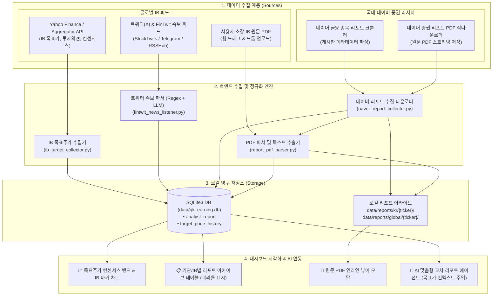

# 10_QK_EARNING — 글로벌 IB 및 네이버증권 리포트·목표주가 추적 요건정의서 (SRS)

- **작성일자**: 2026-09-21
- **문서 버전**: v1.0
- **문서 상태**: 검토 완료 및 요건 정의 (Review & Requirements)
- **대상 모듈**: 리포트 인텔리전스 — **글로벌 투자은행(IB) & 네이버 증권 리포트 목표가 추적 및 PDF 아카이브 시스템**

---

## 1. 기술적 실현 가능성 및 한계점 심층 검토 (Feasibility Review)

### 1) 글로벌 투자은행 (골드만삭스, 시티, JP모건, 모건스탠리 등) 리포트 검토

#### ① 원문(Full PDF) 수집의 현실적 제약
* **기관 전용 유료 페이월(Paywall)**: 골드만삭스(Marquee), JP모건(J.P. Morgan Markets), 모건스탠리(Matrix), 시티그룹(Velocity) 등 글로벌 최상위 IB의 원문 리포트는 연간 수천만~수억 원의 라이선스 비용이 드는 기관 전용 플랫폼 또는 Bloomberg Terminal, FactSet, LSEG Workspace(구 Refinitiv)를 통해서만 정식 유통됩니다.
* **보안 및 저작권 제약**: 웹 포털 로그인 시 2단계 인증(2FA), CAPTCHA, 엄격한 이용약관(ToS) 및 IP 모니터링이 적용되어 있어 백엔드 크롤러를 통한 무단 자동 스크래핑은 차단 위험과 법적 리스크가 높습니다.

#### ② 솔루션: "하이브리드 투-트랙(Two-Track)" 아키텍처
1. **[Track A - 목표가/투자의견 데이터(정량 피드)]**:
   * 글로벌 금융 미디어 및 데이터 피드(`yfinance` analyst recommendations, Benzinga, Finviz, TheFly, FMP 등)를 활용하여 골드만삭스, 시티, JP모건의 **"일자별 투자의견/목표주가 변경 액션(Upgrade/Downgrade, Price Target)"** 데이터를 정기적으로 자동 수집 및 정규화합니다.
   * 이를 통해 종목별 최신 목표가, 시장 컨센서스 평균(Mean), 최고가(High), 최저가(Low), 괴리율(Upside/Downside)을 100% 자동 추적합니다.
2. **[Track B - 트위터(X) FinTwit 실시간 속보 피드 (신속성 극대화)]**:
   * 월스트리트 IB(Goldman, Citi, JPM 등)의 목표가 상향/하향 뉴스는 Bloomberg 터미널 타전 후 수초~수분 이내에 트위터(X) 금융 속보 계정(`@DeItaone`, `@FirstSquawk`, `@Benzinga`, `@TheFlyNews`)에 가장 먼저 게시됩니다.
   * 트위터 공식 API 제약(월 $100~)을 우회하는 **4가지 실용적 수집 경로(RSS/Nitter, Telegram 미러 채널, StockTwits API, twscrape)**와 정규식(Regex)+소형 LLM 기반 파서를 통해 실시간 목표가 변경을 포착합니다.
3. **[Track C - 원문 PDF 보관 및 텍스트 추출(정성 분석)]**:
   * 사용자가 업무상/개인적으로 취득한 글로벌 IB 원문 PDF(골드만, JP모건 등)를 웹 화면에 드래그&드롭(BYOD: Bring Your Own Document)할 수 있는 **스마트 업로드 드롭존**을 구축합니다.
   * 업로드 즉시 백엔드의 `pypdf`/`pdfplumber` 및 파서가 [증권사, 발행일, 목표주가, 핵심 논거]를 자동 추출하여 DB에 색인하고 영구 아카이빙합니다.

---

### 2) 트위터(X / FinTwit) 실시간 속보 수집 타당성 및 구현 방식 심층 검토

#### ① 트위터 속보의 고유한 가치
* **초고속 타전 (Ultra-Low Latency)**: 정식 리포트 PDF가 배포되기 전 또는 정적 금융 API(Yahoo Finance 등)에 반영되기까지 발생하는 수시간~수일의 지연(Lag)을 없애고, **장전/장중 목표가 변경 속보를 즉시 포착**할 수 있음.
* **정형화된 문장 구조**: 금융 속보 트윗은 매우 전형적인 템플릿 문장 구조를 가짐.
  > *"GOLDMAN SACHS RAISES NVIDIA PRICE TARGET TO $185 FROM $165, KEEPS BUY - $NVDA"*
  > *"CITI CUTS TSMC TARGET TO $210, MAINTAINS BUY RATING"*
  > *"JPMORGAN DOWNGRADES ASML TO NEUTRAL FROM OVERWEIGHT, TARGET €750"*

#### ② 트위터 수집 경로별 실현 가능성 (Feasibility) 비교
| 수집 경로 | 비용 및 안정성 | 기술적 장단점 및 채택 여부 |
|:---|:---|:---|
| **A. 공식 X API (Basic)** | 유료 (월 $100) | • 공식 승인 안정성 높으나 매월 $100 비용 발생. (개인/로컬 환경에는 부담) |
| **B. StockTwits 공식 API** | **완전 무료 (추천)** | • `https://api.stocktwits.com/api/2/streams/symbol/{ticker}.json`<br>• 공식 무료 엔드포인트 제공. FinTwit 주요 속보 및 유저 트윗이 실시간 집계됨. |
| **C. 트위터 속보 미러 텔레그램 채널** | **완전 무료 (강력 추천)** | • `@DeItaone`, `Squawk` 속보를 1초 내로 실시간 미러링하는 공개 텔레그램 채널 다수 존재.<br>• Python `python-telegram-bot` 또는 텔레그램 클라이언트 라이브러리(`telethon`)로 100% 무료/무제한 실시간 수신 가능. |
| **D. RSSHub / Nitter RSS 피드** | **완전 무료 (추천)** | • 특정 타겟 계정(`DeItaone`, `FirstSquawk`)의 RSS 피드를 5분 간격으로 폴링.<br>• IP 차단 없이 경량 XML/RSS 파싱으로 구현 극대화. |
| **E. Python `twscrape` (가상 세션)** | 무료 | • 브라우저 토큰을 활용한 비공식 스크래퍼이나, 트위터 UI 변경 시 유지보수 필요. |

**👉 [결론 및 권장 방안]**:
비용 0원의 **[경로 B (StockTwits API) + 경로 C (텔레그램 속보 채널) + 경로 D (Nitter/RSSHub 폴링)]**을 통합한 **"FinTwit 속보 리스너(FinTwit News Listener)"**를 구축합니다.

#### ③ 트윗 텍스트 정규화 및 파싱 파이프라인
* **정규식(Regex) 1차 필터링**: `(GOLDMAN|CITI|JPMORGAN|MORGAN STANLEY|BOFA|BARCLAYS) ... (RAISES|CUTS|LOWERS|MAINTAINS) ... TARGET ... TO (\$?[\d\.]+)`
* **소형 LLM(Gemini Flash) 2차 정밀 정규화**: 비정형 트윗이나 복합 문장의 경우, Gemini Flash를 통해 0.3초 만에 완벽한 JSON(`{broker, ticker, action, prev_target, new_target, rating}`)으로 변환하여 DB에 즉시 적재.

---

### 2) 국내 증권사 및 네이버 증권(Naver Finance) 리서치 검토

#### ① 데이터 공개성 및 수집 타당성
* **완전 공개 무료 데이터**: 네이버 증권 리서치(`finance.naver.com/research/company_list.naver`)는 국내 증권사(미래에셋, 삼성, NH투자, 한국투자, 하나, KB 등)가 발행하는 기업분석 리포트 목록을 무료로 실시간 공개하고 있습니다.
* **원문 첨부파일(PDF) 직다운로드 가능**: 네이버 증권 리서치 게시판은 각 증권사 리포트의 **원문 PDF 다운로드 URL을 HTML 상에 그대로 제공**합니다.
* **구현 타당성**: **100% 실현 가능 (Feasibility: High)**. Python `requests` + `BeautifulSoup`으로 대상 기업(SK하이닉스 `000660`, 삼성전자 `005930` 등)의 리포트를 자동 크롤링하고, PDF 파일을 로컬 스토리지에 무제한 다운로드하여 아카이빙할 수 있습니다.

#### ② 수집 시 고려사항
* **서버 부하 방지**: 1.0초 이상의 요청 딜레이(`time.sleep(1.0)`)와 올바른 User-Agent를 설정하여 네이버 서버의 과부하나 IP 차단을 철저히 방지합니다.
* **저장 구조**: 대용량 PDF는 Git 리포지토리에 커밋되지 않도록 `.gitignore` 대상인 `data/reports/kr/{ticker}/` 디렉터리에 로컬 파일로 저장하고, SQLite DB에는 메타데이터와 파일 경로를 인덱싱합니다.

---

## 2. 시스템 아키텍처 및 데이터 흐름



---

## 3. 데이터베이스 스키마 설계

### 1) `analyst_report` (애널리스트 리포트 메타데이터)
국내외 증권사 및 투자은행의 발행 리포트 기본 정보, 목표가, 원문 경로를 통합 관리합니다.

```sql
CREATE TABLE IF NOT EXISTS analyst_report (
    id INTEGER PRIMARY KEY AUTOINCREMENT,
    entity_id INTEGER NOT NULL,                   -- 대상 기업 ID (entity.id 외래키)
    ticker TEXT NOT NULL,                          -- 종목코드 (NVDA, 000660.KS 등)
    source_type TEXT NOT NULL,                     -- 'GLOBAL_IB', 'NAVER_RESEARCH', 'TWITTER_FINTWIT', 'USER_UPLOAD'
    broker_name TEXT NOT NULL,                     -- Goldman Sachs, Citi, J.P. Morgan, 미래에셋증권 등
    analyst_name TEXT,                             -- 애널리스트 이름 (예: Toshiya Hari, 김동원 등)
    report_date TEXT NOT NULL,                     -- 리포트 발행일자 (YYYY-MM-DD)
    title TEXT NOT NULL,                           -- 리포트 제목 (또는 트윗 요약문)
    rating TEXT,                                   -- Buy, Outperform, Neutral, Hold, Sell, Underweight
    action_type TEXT,                              -- Maintain, Upgrade, Downgrade, Initiate
    target_price REAL,                             -- 목표주가 (원래 통화 기준)
    current_price_at_report REAL,                  -- 리포트 발행 당시 주가
    upside_pct REAL,                               -- 기대 상승여력 ((target_price - current_price) / current_price * 100)
    currency TEXT NOT NULL DEFAULT 'USD',          -- USD, KRW 등
    pdf_url TEXT,                                  -- 원본 다운로드 URL (또는 트윗 링크)
    local_pdf_path TEXT,                           -- 로컬 저장 파일 경로 (data/reports/...)
    summary_text TEXT,                             -- 핵심 요약 문구 (트윗 전문 또는 초록)
    created_at TEXT DEFAULT (datetime('now')),
    FOREIGN KEY (entity_id) REFERENCES entity(id) ON DELETE CASCADE,
    UNIQUE (entity_id, broker_name, report_date, title)
);

CREATE INDEX IF NOT EXISTS idx_analyst_report_ticker_date ON analyst_report(ticker, report_date DESC);
CREATE INDEX IF NOT EXISTS idx_analyst_report_broker ON analyst_report(broker_name);
```

### 2) `target_price_history` (시계열 목표주가 & 컨센서스 밴드)
주가 차트 위에 IB별 목표가 포인트와 시장 컨센서스 평균선을 겹쳐 그리기(Overlay) 위한 일자별 집계 테이블입니다.

```sql
CREATE TABLE IF NOT EXISTS target_price_history (
    id INTEGER PRIMARY KEY AUTOINCREMENT,
    entity_id INTEGER NOT NULL,
    date TEXT NOT NULL,                            -- 기준 일자 (YYYY-MM-DD)
    close_price REAL NOT NULL,                     -- 당일 종가
    target_mean REAL,                              -- 시장 목표가 평균 (Consensus Mean)
    target_high REAL,                              -- 최고 목표가 (High)
    target_low REAL,                               -- 최저 목표가 (Low)
    num_analysts INTEGER,                          -- 추정에 참여한 애널리스트 수
    key_ib_targets_json TEXT,                      -- 주요 IB별 목표가 스냅샷 {"Goldman": 185, "Citi": 170, "JPM": 165}
    created_at TEXT DEFAULT (datetime('now')),
    FOREIGN KEY (entity_id) REFERENCES entity(id) ON DELETE CASCADE,
    UNIQUE (entity_id, date)
);

CREATE INDEX IF NOT EXISTS idx_target_hist_lookup ON target_price_history(entity_id, date DESC);
```

---

## 4. 기능 요구사항 (Functional Requirements)

| 요구사항 ID | 기능 명칭 | 상세 설명 | 우선순위 |
|:---|:---|:---|:---:|
| **FR-01** | **네이버 증권 리서치 자동 크롤러** | • 국내 기업(SK하이닉스 `000660`, 삼성전자 `005930` 등)에 대해 네이버 증권 리서치 게시판 크롤링.<br>• 발행일, 증권사명, 리포트 제목, 투자의견, 목표주가, PDF 원문 링크 파싱 및 중복 제외 적재. | **필수 (P0)** |
| **FR-02** | **네이버 리포트 PDF 자동 다운로드** | • 수집된 네이버 리포트의 PDF 첨부파일을 백그라운드로 안전하게 다운로드.<br>• 로컬 `data/reports/kr/{ticker}/` 디렉터리에 체계적으로 저장하고 DB `local_pdf_path` 갱신. | **필수 (P0)** |
| **FR-03** | **글로벌 IB 목표주가 & 레이팅 피드 수집기** | • 글로벌 빅테크(NVDA, TSM, MSFT, AAPL 등)에 대해 골드만삭스, 시티, JP모건, 모건스탠리 등 주요 IB의 목표주가 변경 내역 및 컨센서스(평균/최고/최저) 자동 집계. | **필수 (P0)** |
| **FR-04** | **목표주가 괴리율 (Upside/Downside) 자동 계산** | • `(목표주가 - 현재주가) / 현재주가 * 100` 수식을 통해 실시간 괴리율 산출.<br>• 증권사별 목표주가와 시장 컨센서스 대비 고평가/저평가 수준 시각화 배지 표시. | **필수 (P0)** |
| **FR-05** | **차트 오버레이 시각화 (목표가 밴드)** | • 메인 주가 차트(Chart.js) 상단에 [목표가 컨센서스 밴드 (High/Mean/Low)] 및 [주요 IB별 목표가 변경 스캐터 포인트]를 토글 형태로 겹쳐 표시. | **중요 (P1)** |
| **FR-06** | **원문 PDF 인라인 뷰어 모달** | • 대시보드 리포트 목록에서 [PDF 보기] 버튼 클릭 시, 브라우저 모달 창을 통해 다운로드된 로컬 PDF를 즉시 열람 및 검색. | **중요 (P1)** |
| **FR-07** | **외부 리포트 수동 업로드 (드래그 & 드롭)** | • 사용자가 개인적으로 소장한 글로벌 IB(Goldman, JPM 등) PDF를 웹 화면에 업로드하면, 제목/날짜/텍스트를 자동 파싱하여 아카이브에 편입. | **보통 (P2)** |
| **FR-08** | **AI 리포트 에이전트 교차 검증 연동** | • AI 보고서 작성 시, 최신 1개월 내 발행된 글로벌 IB 및 국내 증권사의 목표주가 평균, 주력 논거, 상향/하향 추세를 프롬프트 컨텍스트로 자동 주입. | **중요 (P1)** |
| **FR-09** | **트위터(X)/FinTwit 실시간 속보 수집기** | • `@DeItaone`, `Squawk`, `StockTwits` 등의 속보 스트림을 수신하여 골드만삭스, 시티, JP모건의 목표가 변경 뉴스를 1초 단위로 파싱 및 DB 적재. | **중요 (P1)** |

---

## 5. 비기능 요구사항 (Non-Functional Requirements)

| 요구사항 ID | 구분 | 상세 기준 |
|:---|:---|:---|
| **NFR-01** | **크롤링 예절 및 안정성** | • 네이버 증권 요청 시 **1.0초 이상의 딜레이**를 부여하여 서버 과부하 및 IP 차단을 방지.<br>• 표준 HTTP `User-Agent` 헤더 사용 및 타임아웃(10초) 처리. |
| **NFR-02** | **스토리지 관리** | • PDF 파일 다운로드 시 중복 다운로드를 엄격히 방지(파일명 및 URL 대조).<br>• 로컬 PDF 저장 경로는 `.gitignore`에 반영되어 Git 리포지토리에 대용량 바이너리가 유입되지 않도록 보호. |
| **NFR-03** | **오프라인 동작성** | • 외부 네트워크가 연결되지 않은 환경에서도 이미 수집·다운로드된 DB 및 PDF 파일은 100% 정상 조회 가능. |
| **NFR-04** | **UI/UX 디자인 일관성** | • 다크 모드 기반의 네온/글래스모피즘 스타일 준수.<br>• 증권사 배지(골드만: 골드, 시티: 블루, JP모건: 네이비, 네이버: 그린) 등 시각적 식별성 극대화. |

---

## 6. REST API 엔드포인트 규격

### 1) `GET /api/reports/analysts`
* **설명**: 특정 종목의 애널리스트 리포트 목록 및 목표가 조회
* **파라미터**: `ticker` (필수), `source_type` (선택: ALL, GLOBAL_IB, NAVER_RESEARCH), `limit` (기본 50)
* **응답 예시**:
```json
{
  "ticker": "000660.KS",
  "current_price": 192000,
  "consensus_target_mean": 245000,
  "upside_mean_pct": 27.6,
  "total_reports": 12,
  "reports": [
    {
      "id": 1,
      "source_type": "NAVER_RESEARCH",
      "broker_name": "미래에셋증권",
      "analyst_name": "김영건",
      "report_date": "2026-09-18",
      "title": "SK하이닉스 - HBM3E 12단 공급 가시화와 사상 최대 영업이익 전망",
      "rating": "Buy",
      "target_price": 260000,
      "upside_pct": 35.4,
      "has_pdf": true,
      "pdf_url": "/api/reports/pdf/1"
    }
  ]
}
```

### 2) `POST /api/reports/collect/naver`
* **설명**: 네이버 증권 리서치에서 특정 종목의 최신 리포트 크롤링 및 PDF 다운로드 트리거
* **요청 바디**:
```json
{
  "ticker": "000660.KS",
  "company_name": "SK하이닉스",
  "max_pages": 3,
  "download_pdf": true
}
```
* **응답**: 수집된 리포트 건수, 신규 다운로드 PDF 파일 목록.

### 3) `GET /api/reports/target-bands`
* **설명**: 주가 차트에 오버레이할 일자별 목표주가 밴드 시계열 데이터 반환
* **파라미터**: `ticker`, `days` (기본 180)

### 4) `GET /api/reports/pdf/<int:report_id>`
* **설명**: 다운로드된 로컬 PDF 파일을 브라우저 뷰어에 바이너리 스트리밍 (`application/pdf`)

---

## 7. 단계별 구현 로드맵 (Phased Implementation Plan)

### [Phase 1] 네이버 증권 리서치 크롤러 & PDF 다운로더 구축 (국내 종목 우선)
1. **DB 스키마 마이그레이션**: `analyst_report`, `target_price_history` 테이블 생성.
2. **네이버 수집기 서비스 구현** (`app/services/naver_report_collector.py`):
   - `finance.naver.com/research/company_list.naver` HTML 파서 개발.
   - 종목별 리포트 목록, 증권사, 작성자, 제목, 목표가 파싱.
   - PDF 파일 스트리밍 다운로드 및 `data/reports/kr/{ticker}/` 디렉터리 저장.
3. **API 엔드포인트 구현**: `/api/reports/collect/naver`, `/api/reports/analysts`, `/api/reports/pdf/<id>`.
4. **테스트 코드 작성**: 모의 HTML/네트워크 응답 기반의 단위 테스트 (`tests/test_naver_report.py`).

### [Phase 2] 글로벌 IB 목표주가 피드, 트위터(FinTwit) 속보 & PDF 드롭존 구현
1. **글로벌 IB 목표가 피드 수집기** (`app/services/global_ib_collector.py`):
   - `yfinance` recommendations 및 애널리스트 목표가(Mean/High/Low) 연동.
   - 골드만삭스, 시티, JP모건, 모건스탠리 등 IB별 투자의견 변동 추출.
2. **트위터(X) FinTwit 실시간 속보 리스너** (`app/services/fintwit_news_listener.py`):
   - StockTwits API / 텔레그램 속보 채널 / RSSHub 연동.
   - 정규식 + Gemini Flash를 활용한 속보 트윗 목표가/투자의견 즉시 파싱.
3. **로컬 PDF 업로드 & 파서** (`app/services/report_pdf_parser.py`):
   - 사용자 PDF 드래그&드롭 업로드 엔드포인트 구현.
   - 첫 페이지 텍스트 추출 및 메타데이터 파싱.

### [Phase 3] 프론트엔드 대시보드 시각화 & AI 에이전트 연동
1. **차트 목표가 오버레이**: Chart.js 메인 차트에 목표가 컨센서스 밴드(영역) 및 IB 목표가 마커 표시.
2. **리포트 아카이브 UI & PDF 뷰어 모달**: 증권사별 리포트 목록 테이블, 목표가 괴리율 배지, 원클릭 PDF 모달 뷰어.
3. **AI 리포트 에이전트 연동**: AI 맞춤형 분석 보고서 생성 시 최신 IB/국내 리포트 요약 컨텍스트 자동 결합.
