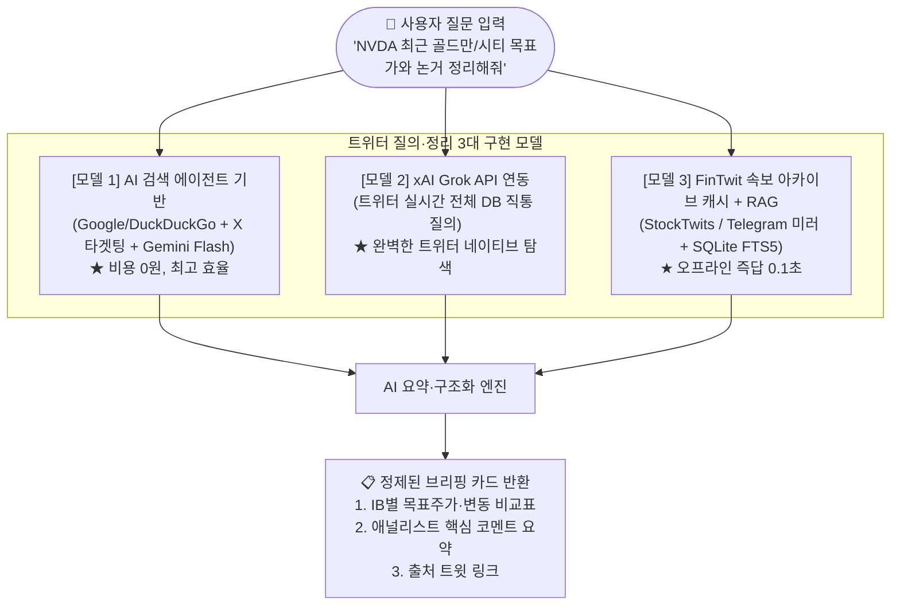
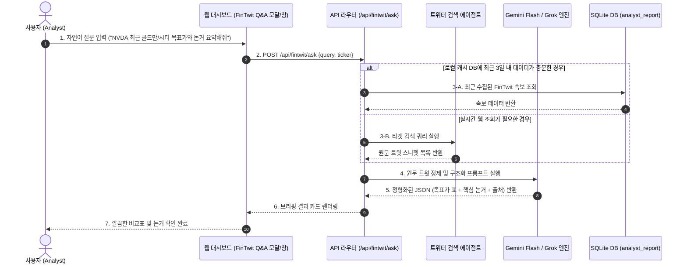

# 10_QK_EARNING — 트위터(X) FinTwit 실시간 목표가 추적 및 AI 질의응답 요건정의서 (SRS)

- **작성일자**: 2026-09-21
- **문서 버전**: v1.0
- **문서 상태**: 설계 완료 및 검토 승인 (Review & Requirements)
- **대상 모듈**: 리포트 인텔리전스 — **FinTwit 실시간 속보 리스너 & 트위터 온디맨드 AI 질의응답 브리핑 시스템**
- **관련 문서**: [docs/2026-09-21_글로벌IB_및_네이버증권_리포트_목표가추적_요건정의서.md](file:///Users/chansoojeon/Library/CloudStorage/Dropbox/03_code/b_0917_10_QK_EARNING/docs/2026-09-21_%EA%B8%80%EB%A1%9C%EB%B2%8CIB_%EB%B0%8F_%EB%84%A4%EC%9D%B4%EB%B2%84%EC%A6%9D%EA%B6%8C_%EB%A6%AC%ED%8F%AC%ED%8A%B8_%EB%AA%A9%ED%91%9C%EA%B0%80%EC%B6%94%EC%A0%81_%EC%9A%94%EA%B1%B4%EC%A0%95%EC%9D%98%EC%84%9C.md)

---

## 1. 추진 배경 및 목표

### 1) 추진 배경 (Background)
* **월스트리트 속보의 초저지연성(Ultra-Low Latency)**:
  * 골드만삭스, 시티, JP모건, 모건스탠리 등 주요 투자은행(IB)의 목표주가 상향/하향(Revision)과 투자의견 변경 소식은 정식 리포트 PDF가 유통되기 전, **Bloomberg Terminal 타전 직후 수초~수분 내에 트위터(X) 금융 속보 계정(FinTwit)에 가장 먼저 게시**됨.
  * 기존 정적 금융 포털이나 무료 주가 API는 데이터 반영까지 수시간~1 영업일의 시차가 존재하여 긴급한 장전/장중 대응이 어려움.
* **사용자 온디맨드 질의응답(On-Demand Q&A) 니즈**:
  * 사용자가 수많은 트윗을 직접 검색하고 피드를 일일이 스크롤하는 것은 극심한 정보 과부하를 유발함.
  * 사용자가 자연어로 *"최근 골드만삭스와 모건스탠리가 엔비디아에 대해 제시한 목표가와 핵심 코멘트가 뭐야?"*라고 물어보면, 시스템이 **트위터 실시간 속보를 탐색하여 정형화된 목표가 비교표와 핵심 논거 요약문으로 깔끔하게 정리**해 주는 지능형 에이전트 기능이 절실함.

### 2) 핵심 목표 (Objectives)
1. **FinTwit 실시간 속보 자동 리스너**: 주요 금융 속보 계정(`@DeItaone`, `Squawk`, `StockTwits`)의 목표가 변동 트윗을 실시간 수신 및 정규화 적재.
2. **트위터 자연어 온디맨드 질의응답 (Twitter Q&A Engine)**: 사용자의 질문에 대해 트위터 실시간 데이터를 조회하고, AI(Gemini / Grok)가 목표가·투자의견·핵심 이유를 구조화하여 즉시 브리핑.
3. **무비용/고효율 아키텍처**: 고가의 공식 X API(월 $100~) 대신, 무료 공식 API(StockTwits), 텔레그램 실시간 미러, 검색 에이전트, xAI Grok 연동 옵션을 지원하는 하이브리드 파이프라인 구축.

---

## 2. 3대 기술 구현 모델 비교 및 검토 (Architecture Options)



### 1) 세부 모델별 장단점 및 채택 기준

| 구분 | 모델 1: AI 검색 에이전트 (권장) | 모델 2: xAI Grok API 연동 | 모델 3: FinTwit 수집 캐시 RAG |
|:---|:---|:---|:---|
| **수집/조회 방식** | `site:x.com` 타겟 웹 검색 도구를 통해 최신 트윗을 실시간 검색 후 Gemini가 요약 | 일론 머스크 xAI의 `grok-beta`를 통해 트위터 실시간 타임라인 직통 검색 | StockTwits API 및 텔레그램 미러 채널에서 미리 DB에 적재해 둔 트윗을 FTS5로 검색 |
| **비용** | **완전 무료** (Gemini 무료 티어 + 무료 검색) | 사용량 기반 종량제 (건당 수원 단위) | **완전 무료** |
| **속보 커버리지** | 최신 24시간~1주일 내 인덱싱된 주요 속보 | **트위터 내부 전체 실시간 트윗 100% 커버** | 사전에 지정된 주요 속보 계정/티커 중심 |
| **응답 속도** | 약 2~3초 | 약 1.5~2초 | **0.1초 (초고속)** |
| **적용 전략** | **기본 모드 (Default)** 로 채택 | **고급 사용자 선택 옵션 (Opt-in)** 제공 | **백그라운드 자동 수집 캐시**로 상시 가동 |

---

## 3. 자연어 질문-정리(Q&A) 워크플로우 설계

### 1) 처리 흐름 시퀀스 (Sequence Diagram)



### 2) AI 구조화 프롬프트 규격
에이전트는 수집된 비정형 트윗 텍스트를 다음 JSON 스키마로 강제 변환합니다:

```json
{
  "ticker": "NVDA",
  "query_summary": "엔비디아에 대한 골드만삭스 및 시티의 최신 목표주가 변동 종합",
  "ib_actions": [
    {
      "broker": "Goldman Sachs",
      "analyst": "Toshiya Hari",
      "current_target": 185.0,
      "prev_target": 165.0,
      "action": "Upgrade",
      "rating": "Buy",
      "currency": "USD",
      "tweet_time": "2026-09-19 06:15 ET",
      "source_account": "@DeItaone",
      "tweet_url": "https://x.com/...",
      "key_point": "블랙웰(Blackwell) 패키징 수율 개선 속도가 예상보다 빠르며 빅4 클라우드 CapEx 지속 상향 수혜"
    }
  ],
  "market_sentiment": "월가 전반의 투자의견은 강력 매수 유지이며 평균 목표가는 $175선으로 형성됨",
  "risks_mentioned": "CoWoS 패키징 병목 잔존 우려 일부 언급"
}
```

---

## 4. 데이터베이스 스키마 설계

트위터 속보 원문과 질의응답 캐시를 위한 전용 테이블 명세입니다.

```sql
-- 1. FinTwit 실시간 트윗 원문 아카이브
CREATE TABLE IF NOT EXISTS fintwit_post (
    id INTEGER PRIMARY KEY AUTOINCREMENT,
    ticker TEXT NOT NULL,                          -- 종목코드 (NVDA, TSM 등)
    author_username TEXT NOT NULL,                 -- 작성자 계정 (@DeItaone, @FirstSquawk 등)
    tweet_id TEXT UNIQUE,                          -- 트위터 고유 트윗 ID
    content_text TEXT NOT NULL,                    -- 트윗 원문 전문
    posted_at TEXT NOT NULL,                       -- 트윗 작성 일시 (ISO-8601)
    extracted_broker TEXT,                         -- 추출된 IB명 (Goldman Sachs 등)
    extracted_target REAL,                         -- 추출된 목표주가
    extracted_action TEXT,                         -- RAISES, CUTS, MAINTAINS
    tweet_url TEXT,                                -- 트윗 웹 링크
    created_at TEXT DEFAULT (datetime('now'))
);

CREATE INDEX IF NOT EXISTS idx_fintwit_ticker_date ON fintwit_post(ticker, posted_at DESC);
CREATE INDEX IF NOT EXISTS idx_fintwit_broker ON fintwit_post(extracted_broker);

-- 2. 사용자 질의응답 히스토리 및 캐시
CREATE TABLE IF NOT EXISTS fintwit_qa_cache (
    id INTEGER PRIMARY KEY AUTOINCREMENT,
    ticker TEXT NOT NULL,
    user_query TEXT NOT NULL,                      -- 사용자 질문 텍스트
    response_json TEXT NOT NULL,                   -- AI가 정리한 JSON 결과
    created_at TEXT DEFAULT (datetime('now'))
);
```

---

## 5. 기능 요구사항 명세 (Functional Requirements)

| 요구사항 ID | 기능 명칭 | 상세 명세 | 우선순위 |
|:---|:---|:---|:---:|
| **FT-01** | **자연어 질문 입력 인터페이스** | • 대시보드 상단/AI 스튜디오에 FinTwit 전용 질문 입력창 제공.<br>• 예시 질문 칩 제공 (예: *"최근 골드만삭스 목표가 요약"*, *"오늘자 월가 트윗 반응"*). | **필수 (P0)** |
| **FT-02** | **실시간 트윗 검색 및 AI 정제 엔진** | • 사용자 질문으로부터 기업 티커와 대상 IB를 감지하여 타겟 트윗 검색 실행.<br>• Gemini Flash를 통해 비정형 트윗을 2초 내에 [목표가 비교표 + 핵심 코멘트 요약]으로 변환. | **필수 (P0)** |
| **FT-03** | **출처 링크(Citation) 원클릭 이동** | • 정리된 각 IB 항목마다 해당 트윗 원문 URL 링크 배지를 함께 표시하여 사용자가 원본 트윗을 1초 만에 검증할 수 있도록 지원. | **필수 (P0)** |
| **FT-04** | **StockTwits 무료 API 스트림 연동** | • `https://api.stocktwits.com/api/2/streams/symbol/{ticker}.json` 연동을 통해 공식 무료 피드 자동 수신. | **중요 (P1)** |
| **FT-05** | **텔레그램 금융 속보 미러 리스너** | • Deltaone, Squawk 등 트위터 속보를 1초 단위로 전달하는 텔레그램 채널의 메시지를 실시간 감지하여 DB 적재. | **중요 (P1)** |
| **FT-06** | **xAI Grok API 확장 플러그인 (옵션)** | • 사용자가 본인의 xAI API Key를 입력할 경우, 트위터 공식 내부 실시간 검색 엔진(Grok)을 다이렉트로 사용할 수 있는 토글 지원. | **보통 (P2)** |

---

## 6. REST API 엔드포인트 규격

### 1) `POST /api/fintwit/ask`
* **설명**: 트위터 실시간 속보를 대상으로 자연어 질문을 던지고 정제된 브리핑 카드를 반환받음
* **요청 바디**:
```json
{
  "ticker": "NVDA",
  "query": "최근 1주일간 골드만삭스와 시티의 목표가와 주요 이유를 요약해줘",
  "use_grok": false
}
```
* **응답**:
```json
{
  "status": "success",
  "ticker": "NVDA",
  "query": "최근 1주일간 골드만삭스와 시티의 목표가와 주요 이유를 요약해줘",
  "summary_markdown": "### 📊 NVDA 월가 IB 목표주가 최신 변동 종합\n\n| 투자은행 | 목표가 | 직전가 | 의견 | 변동일시 |\n|---|---|---|---|---|\n| Goldman Sachs | $185 | $165 | Buy | 09/19 06:15 |\n| Citi | $175 | $175 | Buy | 09/18 14:20 |\n\n**핵심 논거:**\n- **Goldman**: 블랙웰 공급 지연 우려 완화 및 패키징 수율 대폭 개선\n- **Citi**: 데이터센터 수요 견조 확인",
  "ib_actions": [
    {
      "broker": "Goldman Sachs",
      "target_price": 185.0,
      "prev_target": 165.0,
      "action": "Upgrade",
      "rating": "Buy",
      "tweet_url": "https://x.com/DeItaone/status/123456789"
    }
  ],
  "source_count": 5
}
```

### 2) `GET /api/fintwit/stream`
* **설명**: 특정 티커의 최신 24시간 내 FinTwit 속보 리스트 조회
* **파라미터**: `ticker=NVDA`, `limit=20`

---

## 7. UI/UX 화면 구성 설계

```text
+------------------------------------------------------------------------------------+
| ⚡ FinTwit 실시간 속보 & AI 질문 인터랙션                                            |
+------------------------------------------------------------------------------------+
| [ 💬 질문 입력: 최근 골드만삭스, 시티의 목표가와 핵심 논거 요약해줘...           ] [질문하기]|
| [추천 질문] [📌 최신 목표가 상향 IB 목록]  [📌 Blackwell 수율 관련 코멘트]  [📌 오늘자 속보] |
+------------------------------------------------------------------------------------+
| 🤖 AI 실시간 브리핑 결과:                                                          |
|                                                                                    |
|  📊 NVDA 최신 월가 IB 목표주가 변동표                                              |
|  +----------------+-----------+-----------+----------+--------+------------------+  |
|  | 투자은행 (IB)   | 최신 목표 | 직전 목표 | 변동구분 | 의견   | 출처 링크        |  |
|  +----------------+-----------+-----------+----------+--------+------------------+  |
|  | Goldman Sachs  | $185      | $165      | 🔺 상향  | Buy    | [🔗 @DeItaone]   |  |
|  | Citi           | $175      | $170      | 🔺 상향  | Buy    | [🔗 @FirstSquawk]|  |
|  +----------------+-----------+-----------+----------+--------+------------------+  |
|                                                                                    |
|  💡 핵심 논거 및 애널리스트 코멘트:                                                |
|  • Goldman Sachs: 블랙웰(Blackwell) 패키징 수율 개선 확인, 4Q CapEx 모멘텀 유지.   |
|  • Citi: 클라우드 빅4의 AI 인프라 투자 지속으로 데이터센터 가이던스 상회 전망.      |
+------------------------------------------------------------------------------------+
```

---

## 8. 구현 로드맵

1. **Step 1: 트위터 속보 수집기 & 캐시 테이블 구축**
   - SQLite `fintwit_post` 테이블 마이그레이션.
   - StockTwits 무료 심볼 스트림 연동 (`app/services/fintwit_stream_collector.py`).
2. **Step 2: AI 실시간 검색 및 정제 에이전트 개발**
   - 사용자 질문 파서 및 타겟 검색 쿼리 빌더 구현 (`app/services/fintwit_qa_agent.py`).
   - Gemini Flash 구조화 프롬프트 및 JSON 스키마 강제 파싱 적용.
3. **Step 3: 대시보드 FinTwit Q&A 위젯 연동**
   - 웹 대시보드 상단에 자연어 질문 입력 컴포넌트 및 브리핑 카드 UI 렌더러 추가.
   - 옵션: xAI Grok API 키 연동 토글 제공.
