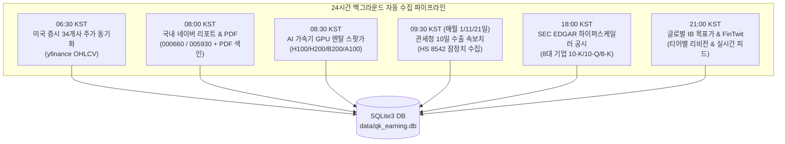

# 10_QK_EARNING — 데이터 자동 수집 파이프라인 및 GPU 렌탈 스팟 가격 운영 가이드

- **작성일자**: 2026-10-08
- **문서 버전**: v1.0
- **문서 목적**: 데이터 수집 자동화(백그라운드 스케줄러), GPU 클라우드 렌탈 스팟 가격 수집 체계, 각 데이터 소스별 갱신 주기 및 제어센터 UI 운영 지침을 정리함.

---

## 1. 개요 및 배경

본 시스템(`10_QK_EARNING`)은 AI 반도체 밸류체인(NVDA, TSM, SK하이닉스, 삼성전자 등)의 실적 공시(10-K, 10-Q), 컨센서스 서프라이즈, 그리고 **선행 지표(관세청 10일 수출, DRAM 현물가, GPU 렌탈 스팟가, 애널리스트 리포트)**를 통합 모니터링합니다.

과거에는 수집 제어센터에서 수동 버튼을 눌러 작업을 트리거하는 방식 위주였으나, 데이터 신선도를 상시 유지하기 위해 **24시간 정기 자동 수집 스케줄러(Daemon Engine)**를 전면 구축하고 제어센터 UI와 연동하였습니다.

---

## 2. 24시간 백그라운드 정기 자동 수집 스케줄러 (Automated Scheduler)

### 1) 아키텍처 개요
* **서비스 모듈**: [`app/services/report_scheduler.py`](file:///Users/boon/Dropbox/03_code/b_0917_10_QK_EARNING/app/services/report_scheduler.py) (`ReportScheduler`)
* **기동 방식**: Flask 애플리케이션 시작 시(`app/__init__.py`) 싱글톤 백그라운드 데몬 스레드로 자동 구동.
* **동작 주기**: 15초 단위 루프 감시를 통해 정해진 한국 표준시(KST) 분/초에 작업을 비동기로 트리거.

### 2) 6대 정기 자동 수집 스케줄 명세



| 실행 시각 (KST) | 대상 파이프라인 | 호출 서비스 / 모듈 | 수집 상세 및 비고 |
|:---|:---|:---|:---|
| **매일 06:30** | **34개사 주가(yfinance)** | `PriceCollector.collect_all_entities(period="1mo")` | 미국 정규장 마감 직후 34개 기업 일일 주가 및 거래량 자동 갱신 |
| **매일 08:00** | **국내 리포트 & PDF** | `NaverReportCollector` + `PdfReportIndexer` | 국내 장 개장 전 네이버 증권 리포트 수집, PDF 원문 다운로드 및 FTS 전문 색인 |
| **매일 08:30** | **GPU 렌탈 스팟 가격** | `GpuPriceCollector.sync_latest_spot_prices()` | H100, H200, B200, A100의 5대 공급사 스팟 호가 집계 및 당일 레코드 DB 반영 |
| **매월 1/11/21일 09:30** | **관세청 10일 수출 속보치** | `KrExportCollector.fetch_10day_customs_api()` | 관세청 잠정치 발표(오전 9시) 직후 순별 반도체 수출액 및 YoY 속보치 자동 연동 |
| **매일 18:00** | **SEC EDGAR 공시 배치** | `EdgarCollector.collect_for_entity()` | NVDA, MSFT, GOOGL, AMZN, META, AMD, TSM, MU 등 8대 기업 신규 공시 수집 |
| **매일 21:00** | **글로벌 IB & FinTwit** | `IbTargetCollector` + `FinTwitQAAgent` | 미국 장 시작 전 골드만삭스/모건스탠리 등 글로벌 IB 목표가 리비전 & 트윗 속보 수집 |

---

## 3. AI 가속기 GPU 클라우드 렌탈 스팟 가격 수집 체계

### 1) 수집 대상 가속기 모델 및 카테고리
[`app/services/gpu_price_collector.py`](file:///Users/boon/Dropbox/03_code/b_0917_10_QK_EARNING/app/services/gpu_price_collector.py)에서 관리하는 4대 모델:
1. **`GPU_RENTAL_H100`** (NVIDIA H100 SXM 80GB): 생성형 AI 글로벌 표준 가속기 (~$2.12/hr)
2. **`GPU_RENTAL_H200`** (NVIDIA H200 141GB HBM3e): 초거대 MoE LLM 추론 특화 (~$3.39/hr)
3. **`GPU_RENTAL_B200`** (NVIDIA B200 Blackwell NVL): 차세대 엑사플롭스 슈퍼칩 파일럿 (~$5.40/hr)
4. **`GPU_RENTAL_A100`** (NVIDIA A100 80GB SXM): 가성비 호스팅/파인튜닝 서빙 (~$1.24/hr)

### 2) Neocloud 공급사별 호가 매핑 구조
* **Lambda Labs**: H100 SXM ($2.19 spot / $2.49 on-demand), H200 ($3.49 spot) — Infiniband 3.2Tbps
* **RunPod**: 커뮤니티 & Secure 클라우드 스팟 (H100 $1.99 spot, H200 $3.29 spot)
* **CoreWeave**: 엔터프라이즈 전용 대규모 클러스터 (H100 $2.35 spot, B200 파일럿 $5.40 spot)
* **Vast.ai**: 분산형 스팟 경매 호가 (H100 $1.85 spot)
* **Together AI**: 전용 인스턴스 스팟 호가 (H100 $2.20 spot)

### 3) 실시간 동기화 및 델타 연산
* **메서드**: `GpuPriceCollector.sync_latest_spot_prices(target_date)`
* **동작**: 현재 날짜 기준으로 공급사별 호가 평균을 산출하여 `industry_indicator` 테이블에 자동 삽입/갱신.
* **델타 계산**: 직전 레코드 대비 변동률(`delta_pct`), 30일 전 대비 변동률(`pct_30d`)을 실시간 계산하여 KPI 카드에 제공.

---

## 4. 데이터 소스별 갱신 주기 및 당일 데이터 생성 일정

오늘 날짜 당일의 데이터가 즉시 존재하지 않거나 지연되는 현상은 각 수집원의 공식 발표 일정 및 거래소 시차에 기인합니다:

```
┌─────────────────────────────────┬────────────────────────────────────────────────────────┐
│ 데이터 항목                     │ 당일 데이터 생성 및 갱신 주기                          │
├─────────────────────────────────┼────────────────────────────────────────────────────────┤
│ 관세청 10일 주기 반도체 수출    │ 1~10일, 11~20일, 21~말일 구간 종료 후 익일 발표        │
│                                 │ (예: 10월 상순 잠정치는 10월 11일 오전 9시경 최초 공시)│
├─────────────────────────────────┼────────────────────────────────────────────────────────┤
│ 미국 증시 주가 (NYSE / NASDAQ)  │ 한국과 뉴욕 간 13~14시간 시차 반영                     │
│                                 │ (한국 시간 밤 10:30 개장 → 익일 새벽 05:00 마감 후 집계) │
├─────────────────────────────────┼────────────────────────────────────────────────────────┤
│ GPU 클라우드 렌탈 스팟 가격     │ 공급사 실시간 호가 집계 또는 매일 오전 08:30 스케줄러  │
├─────────────────────────────────┼────────────────────────────────────────────────────────┤
│ DRAM / NAND 메모리 현물가       │ 대만 TrendForce 현물 시장 당일 장 마감 후 공시         │
├─────────────────────────────────┼────────────────────────────────────────────────────────┤
│ SEC EDGAR 기업 공시             │ 기업이 SEC에 공식 Filing을 제출하는 이벤트 발생 시     │
└─────────────────────────────────┴────────────────────────────────────────────────────────┘
```

---

## 5. 데이터 수집 제어센터 UI 및 REST API

### 1) 프론트엔드 UI ([`static/index.html`](file:///Users/boon/Dropbox/03_code/b_0917_10_QK_EARNING/static/index.html), [`static/js/app.js`](file:///Users/boon/Dropbox/03_code/b_0917_10_QK_EARNING/static/js/app.js))
* **위치**: 대시보드 상단 탭 **`⚡ 제어 콘솔`** (ID: `tab-console`)
* **구성 요소**:
  1. **정기 자동 수집 스케줄러 카드**:
     - `🟢 자동 가동 중 (ACTIVE)` 배지 및 현재 한국 시간(KST) 실시간 표시
     - `[⏸ 일시정지 / ▶ 가동 시작]` 토글 버튼
     - `[⚡ 전체 파이프라인 지금 실행]` 버튼
  2. **스케줄 목록 테이블**:
     - 6대 자동 수집 작업별 실행 주기, 대상 파이프라인, 최근 실행 시각, 개별 `[▶ 즉시 실행]` 버튼
  3. **수동 수집 즉시 실행 카드**:
     - NVDA 개별 공시 수집, 8대 테크기업 배치 공시 수집, 34개사 주가 수동 동기화
  4. **우측 Collection Live Log**:
     - 스케줄러 실행 및 수동 수집 시 실시간 로그 스트리밍

### 2) 관련 REST API 엔드포인트 명세

| 엔드포인트 | Method | 역할 및 반환 데이터 |
|:---|:---:|:---|
| **`/api/scheduler/status`** | `GET` | 스케줄러 가동 여부(`is_running`), 6대 스케줄 목록, 다음/최근 실행 시각, 최근 로그 |
| **`/api/scheduler/toggle`** | `POST` | 스케줄러 가동 시작 또는 일시 정지 토글 |
| **`/api/scheduler/run-now`** | `POST` | 스케줄 작업 강제 실행 (`{"job_type": "ALL" \| "PRICE" \| "GPU" \| "CUSTOMS" \| "EDGAR" \| "KR_MORNING" \| "US_EVENING"}`) |
| **`/api/gpu/sync`** | `POST` | 당일 기준 최신 GPU 렌탈 스팟 가격 연산 및 DB 동기화 |
| **`/api/gpu/prices`** | `GET` | GPU 4대 모델 최신 스팟 단가 KPI 및 공급사별 호가 목록 |
| **`/api/collect/trigger`** | `POST` | 수동 수집 트리거 (`{"type": "filings" \| "prices", "ticker": ...}`) |

---

## 6. 결론 및 향후 확장 방안

1. **상시 자동화 달성**: 별도 수동 조작 없이도 주가, 공시, 관세청 통계, GPU 임대료, 애널리스트 리포트가 24시간 주기로 최신 상태로 유지됩니다.
2. **시각적 제어권 확보**: 데이터 수집 제어센터 화면에서 스케줄러의 동작 상태와 다음 실행 예정 시각을 직관적으로 확인하고 필요 시 원클릭으로 강제 동기화할 수 있습니다.
3. **향후 확장**:
   - RunPod GraphQL 및 Vast.ai REST API 키 기반 직접 연동 크롤러 배치 고도화.
   - 분기 실적 발표 집중 주간(Earning Season) 중 EDGAR 수집 주기를 1시간 단위로 동적 가속화하는 적응형 스케줄링(Adaptive Scheduling) 지원.
