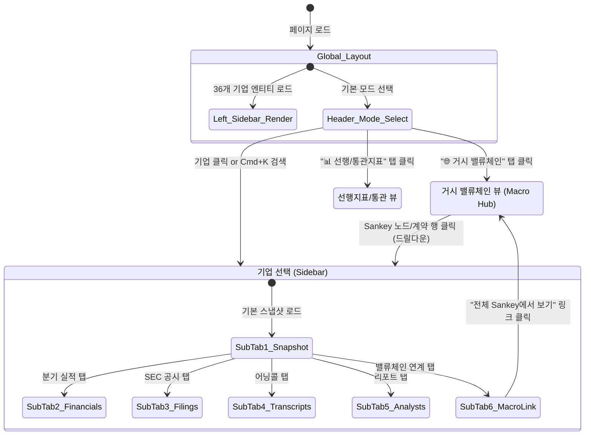

# [화면 스케치 & 와이어프레임] 회사별 통합 메뉴 & Memory Claude 융합 UI

**문서 버전:** v1.0  
**연계 문서:** [docs/2026-10-08_회사별메뉴_및_MemoryClaude통합_화면요건정의서.md](file:///Users/boon/Dropbox/03_code/b_0917_10_QK_EARNING/docs/2026-10-08_%E1%84%92%E1%85%AC%E1%84%89%E1%85%A1%E1%84%87%E1%85%A7%E1%86%AF%E1%84%86%E1%85%A6%E1%84%82%E1%85%B2_%E1%84%86%E1%85%B5%E1%86%BE_MemoryClaude%E1%84%90%E1%85%A9%E1%86%BC%E1%84%92%E1%85%A1%E1%86%B8_%E1%84%92%E1%85%AA%E1%84%86%E1%85%A7%E1%86%AB%E1%84%8B%E1%85%AD%E1%84%80%E1%85%A5%E1%86%AB%E1%84%8C%E1%85%A5%E1%86%BC%E1%84%8B%E1%85%B4%E1%84%89%E1%85%A5.md)  
**작성 목적:** `10_QK_EARNING`의 회사 중심(Company-Centric) 화면 구성과 `Memory Claude`의 거시 밸류체인 엔진이 결합된 전체 UI 레이아웃을 텍스트 기반 시각 스케치(ASCII Wireframe)로 구체화한다.

---

## 1. 전체 화면 기본 프레임워크 (Global Layout Structure)

전체 화면은 **[상단 글로벌 헤더]**와 좌측 **[36개 기업 네비게이터 사이드바]**, 우측 **[메인 워크스페이스]**의 2분할 스플릿 구조를 취합니다.

```text
┌────────────────────────────────────────────────────────────────────────────────────────────────────────────────────────┐
│ 📈 QK_EARNING × Memory Claude  │ 🌐 거시 밸류체인   📊 선행/통관지표   📅 어닝 캘린더   🤖 리포트 스튜디오 │ ⏰ 08:00 자동수집 가동중 │ 🔍 [Cmd+K] 기업 검색 │
├────────────────────────────────┴───────────────────────────────────────────────────────────────────────────────────────┴──────────────────────┤
│ ◀ [접기]                                                                                                                                       │
│                                │                                                                                                               │
│ ┌── 🏢 밸류체인 기업 (36) ─────┐ │ ┌── [🏢 NVDA] NVIDIA Corp. · 엔비디아 ───────────────────────────────────────── 🇺🇸 NASDAQ · L3 AI가속기 · CIK:0001045810 ──┐ │
│ │ 🔍 티커/기업명 필터...       │ │ │ $138.25  ▲ +3.42% (+4.57)  │ 다음 실적: 2026-11-25 (D-48) │ OPM: 62.8% │ 목표가: $165.00 (+19.3% Upside) │ │
│ ├──────────────────────────────┤ │ ├───────────────────────────────────────────────────────────────────────────────────────────────────────────┤
│ │ ▼ L2 하이퍼스케일러 (7)      │ │ │ [ 📊 기업 요약 ] [ 📈 분기 실적(10-Q) ] [ 📑 SEC 공시 원문 ] [ 🎙️ 어닝콜 ] [ 🎯 애널리스트 ] [ 🔗 밸류체인·Memory ]    │ │
│ │   🇺🇸 MSFT 마이크로소프트 ⚡D-7│ │ ├───────────────────────────────────────────────────────────────────────────────────────────────────────────┤
│ │   🇺🇸 GOOGL 알파벳(구글)      │ │ │                                                                                                           │
│ │   🇺🇸 AMZN 아마존             │ │ │                                                                                                           │
│ │   🇺🇸 META 메타        🔥D-Day │ │ │                                                                                                           │
│ │   🇺🇸 ORCL 오라클             │ │ │                                 [ 선택된 서브탭별 상세 작업 영역 (메인 뷰) ]                                  │
│ │   🇺🇸 CRWV 코어위브           │ │ │                                                                                                           │
│ │   🇳🇱 NBIS 네비우스           │ │ │                                                                                                           │
│ ├──────────────────────────────┤ │ │                                                                                                           │
│ │ ▼ L3 AI 컴퓨팅/가속기 (5)    │ │ │                                                                                                           │
│ │ ▶ 🇺🇸 NVDA 엔비디아    (D-48) │ │ │                                                                                                           │
│ │   🇺🇸 AMD  AMD                │ │ │                                                                                                           │
│ │   🇺🇸 AVGO 브로드컴           │ │ │                                                                                                           │
│ │   🇬🇧 ARM  Arm                │ │ │                                                                                                           │
│ │   🇺🇸 INTC 인텔               │ │ │                                                                                                           │
│ ├──────────────────────────────┤ │ │                                                                                                           │
│ │ ▶ L4 파운드리/장비 (7)       │ │ │                                                                                                           │
│ │ ▶ L5 메모리/스토리지 (5)     │ │ │                                                                                                           │
│ │ ▶ L6 광통신/네트워킹 (3)     │ │ │                                                                                                           │
│ │ ▶ L7 인프라/특수 (3)         │ │ │                                                                                                           │
│ │ ▶ L8 전력/에너지 인프라 (4)  │ │ │                                                                                                           │
│ └──────────────────────────────┘ │ └───────────────────────────────────────────────────────────────────────────────────────────────────────────┘ │
└────────────────────────────────────────────────────────────────────────────────────────────────────────────────────────────────────────────────┘
```

---

## 2. 화면 스케치: 회사별 통합 허브 (Company Intelligence Hub)

특정 기업(예: **NVDA**)을 선택했을 때 우측 메인 영역에 나타나는 6개 서브탭 상세 스케치입니다.

---

### 2.1 [서브탭 1] 📊 기업 요약 & 스냅샷 (Company Snapshot)

```text
┌── [상단 Quick KPI 카드 4종] ──────────────────────────────────────────────────────────────────────────────────────────────┐
│ ┌─────────────────────────┐ ┌─────────────────────────┐ ┌─────────────────────────┐ ┌─────────────────────────┐ │
│ │ ⏳ 다음 실적 카운트다운   │ │ 💰 최근 분기 총매출     │ │ 🎯 최근 분기 Beat/Miss   │ │ 🎯 IB 평균 목표주가     │ │
│ │        D-48             │ │        $39.5B           │ │      BEAT (+4.8%)       │ │        $165.00          │ │
│ │ 2026-11-25 17:00 ET     │ │ YoY +122.0% (OPM 62.8%) │ │ EPS $0.78 (컨센 $0.74)  │ │ 34개 IB 종합 (상승 +19.3%)│ │
│ └─────────────────────────┘ └─────────────────────────┘ └─────────────────────────┘ └─────────────────────────┘ │
└─────────────────────────────────────────────────────────────────────────────────────────────────────────────────────┘

┌── [좌: 90일 일별 주가 추이 (OHLCV)] ────────────────────┐ ┌── [우: 사업 부문별 매출 비중 & 밸류체인 포지션] ───────┐
│ [Chart: NVDA 90-Day Trend]                              │ │ [매출 비중 파이 차트]                                   │
│  $140 ┤              ╭───╮                              │ │  ████████████████████░░░░░░  데이터센터 (87.5%, $34.5B) │
│  $130 ┤        ╭─────╯   ╰─╮      ╭── (현재 $138.25)     │ │  ███░░░░░░░░░░░░░░░░░░░░░░░  게이밍 (8.2%, $3.2B)       │
│  $120 ┤    ╭───╯           ╰──────╯                     │ │  █░░░░░░░░░░░░░░░░░░░░░░░░░  프로페셔널/오토 (4.3%)      │
│  $110 ┤╭───╯                                            │ ├───────────────────────────────────────────────────────┤
│       └┬─────────┬─────────┬─────────┬─────────┬─────── │ │ 🌐 밸류체인 내 핵심 포지션:                            │
│       08/01     08/15     09/01     09/15     10/01     │ │  • L3 AI 가속기 시장 점유율 88% 지배                    │
│ [거래량: ||||| | |||||| |||| |||||||| ||||| ||||||| ]   │ │  • 주요 공급선: TSM(3nm CoWoS), SK하이닉스(HBM3E), VRT│
│                                                         │ │  • 주요 고객사: MSFT(21%), META(13%), AMZN, GOOGL     │
└─────────────────────────────────────────────────────────┘ └───────────────────────────────────────────────────────┘
```

---

### 2.2 [서브탭 2] 📈 분기 실적(10-Q/K) & Beat/Miss 시계열

```text
┌── 📈 2020~2026 장기 분기 실적 추이 (매출액 & 영업이익 & CapEx) ────────────────────────────────────────────────────────┐
│  $40B ┤                                                 [■ 매출액  ■ 영업이익  ■ 설비투자(CapEx)]                     │
│  $30B ┤                                           ╭───╮                                                               │
│  $20B ┤                                     ╭───╮ │   │                                                               │
│  $10B ┤ ╭─╮ ╭─╮ ╭─╮ ╭─╮ ╭─╮ ╭─╮ ╭─╮ ╭─╮ ╭─╮ │   │ │   │                                                               │
│   $0B ┴─┴─┴─┴─┴─┴─┴─┴─┴─┴─┴─┴─┴─┴─┴─┴─┴─┴─┴─┴───┴─┴───┴───────────────────────────────────────────────────────────────┤
│        22Q1  22Q3  23Q1  23Q3  24Q1  24Q3  25Q1  25Q3  26Q1  26Q2                                                     │
└───────────────────────────────────────────────────────────────────────────────────────────────────────────────────────┘

┌── 📋 10-Q / 10-K 공시 연계 분기 재무 테이블 ──────────────────────────────────────────────────────────────────────────┐
│ 분기     │ 공시종류 │ 실적발표일 │ 총매출액    │ YoY 성장률 │ 영업이익    │ 영업이익률 │ EPS(실제/컨센) │ 서프라이즈 │ 주가반응(1D/5D)│
├──────────┼──────────┼────────────┼─────────────┼────────────┼─────────────┼────────────┼────────────────┼────────────┼────────────────┤
│ 2026-Q2  │ 10-Q     │ 2026-08-26 │ $39,520M    │ +122.0%    │ $24,820M    │ 62.8%      │ $0.78 / $0.74  │ 🟢 Beat+5% │ ▲+4.2% / +7.8% │
│ 2026-Q1  │ 10-Q     │ 2026-05-20 │ $26,044M    │ +262.1%    │ $16,909M    │ 64.9%      │ $0.61 / $0.56  │ 🟢 Beat+9% │ ▲+9.3% /+15.2% │
│ 2025-Q4  │ 10-K     │ 2026-02-21 │ $22,103M    │ +265.3%    │ $13,615M    │ 61.6%      │ $0.51 / $0.46  │ 🟢 Beat+11%│ ▲+16.4%/+22.1% │
│ 2025-Q3  │ 10-Q     │ 2025-11-20 │ $18,120M    │ +205.5%    │ $10,417M    │ 57.5%      │ $0.40 / $0.34  │ 🟢 Beat+18%│ ▲+2.1% / -1.5% │
└──────────┴──────────┴────────────┴─────────────┴────────────┴─────────────┴────────────┴────────────────┴────────────┴────────────────┘
```

---

### 2.3 [서브탭 3] 📑 SEC 공시 원문 & FTS 텍스트 뷰어

```text
┌── 📑 SEC 정기/수시 공시 목록 ───────────────────────────────────────────┬── 🔍 FTS5 전문 검색 & MD&A 인텔리전스 ───────────────┐
│ 필터: [모든 양식(All) ▼] [검색어: Blackwell            ]                │ 🎙️ NVDA 2026-Q2 (10-Q) 경영진 실적 분석 (MD&A)      │
├─────────┬───────┬────────────┬───────────┬────────────┬─────────────────┤ ┌───────────────────────────────────────────────────┐ │
│ 보고서  │ 분기  │ 제출일자   │ 상태      │ 원문 파일  │ 액션            │ │ [ MD&A 요약 ] [ 리스크 요인(1A) ] [ 원문 전문 ]   │ │
├─────────┼───────┼────────────┼───────────┼────────────┼─────────────────┤ ├───────────────────────────────────────────────────┤ │
│ 10-Q    │ 26-Q2 │ 2026-08-26 │DOWNLOADED │ 18.2 MB    │ [선택됨]        │ │ ■ 데이터센터 부문 성과 (Item 2)                  │ │
│ 8-K     │ 26-Q2 │ 2026-08-26 │DOWNLOADED │  1.4 MB    │ [열람]          │ │   데이터센터 매출액은 $34.5B로 전년동기 대비      │ │
│ 10-Q    │ 26-Q1 │ 2026-05-20 │DOWNLOADED │ 17.5 MB    │ [열람]          │ │   154% 증가함. Hopper 아키텍처에 대한 수요가     │ │
│ 10-K    │ 25-FY │ 2026-02-21 │DOWNLOADED │ 42.1 MB    │ [열람]          │ │   견고하게 유지되었으며, Blackwell 샘플 출하가    │ │
│ 8-K     │ 25-Q4 │ 2026-01-08 │RECORDED   │  -         │ [⚡다운로드]    │ │   본격 개시됨.                                    │ │
└─────────┴───────┴────────────┴───────────┴────────────┴─────────────────┘ │                                                   │ │
                                                                            │ ■ 공급망 제약 및 패키징 코멘트                     │ │
                                                                            │   "CoWoS-L 첨단 패키징 및 HBM3E 공급 능력 확대를   │ │
                                                                            │   위해 TSMC 및 주요 메모리 파트너사와 긴밀히 협력..."│ │
                                                                            │                                                   │ │
                                                                            │ [ 🔗 SEC 공식 원문(HTML) 새창 열기 ↗ ] [ 📋 복사 ] │ │
                                                                            └───────────────────────────────────────────────────┘ │
                                                                            └─────────────────────────────────────────────────────┘
```

---

### 2.4 [서브탭 4] 🎙️ 어닝콜 트랜스크립트 2분할 뷰어

```text
┌── 🎧 컨퍼런스콜 분기 선택 & 필터 ──────────────────────────────────────┬── 📖 트랜스크립트 세션별 리더 (Speaker & Remarks) ───┐
│ [ 2026-Q2 어닝콜 ▼ ]  일자: 2026-08-26 17:00 ET                         │ 🎙️ Jensen Huang (President & CEO)                   │
│ 🔍 키워드 검색: [ HBM3E                ] (언급 24회)                   │ ─────────────────────────────────────────────────── │
├────────────────────────────────────────────────────────────────────────┤ "Blackwell architecture customer demand is          │
│ 세션 목록:                                                             │  unprecedented, well exceeding available supply.    │
│  ● 00:00 - 18:20  [경영진 발표] Colette Kress (CFO)                    │  We are scaling volume production with TSMC and     │
│  ● 18:21 - 32:45  [경영진 발표] Jensen Huang (CEO) [선택]              │  our memory partner <mark>HBM3E</mark> shipments    │
│  ● 32:46 - 41:10  [Q&A #1] Toshiya Hari (Goldman Sachs)                │  are ramping steeply into the second half..."       │
│  ● 41:11 - 48:30  [Q&A #2] Stacy Rasgon (Bernstein)                    │                                                     │
│  ● 48:31 - 56:00  [Q&A #3] Timothy Arcuri (UBS)                        │ ─────────────────────────────────────────────────── │
│  ● 56:01 - 62:15  [Q&A #4] Vivek Arya (BofA)                           │ ❓ Q&A: Toshiya Hari (Goldman Sachs)                │
│                                                                        │ "Could you elaborate on the margin trajectory as    │
│ [핵심 언급 버즈워드]:                                                  │  Blackwell ramps versus Hopper?"                    │
│  #Blackwell(48)  #HBM3E(24)  #SovereignAI(15)  #CapEx(32)              │                                                     │
└────────────────────────────────────────────────────────────────────────┴─────────────────────────────────────────────────────┘
```

---

### 2.5 [서브탭 5] 🎯 애널리스트 리포트 & 목표주가 인텔리전스

```text
┌── 🎯 글로벌 IB 목표주가 변동 히스토리 차트 ──────────────────────────────┬── 📄 국내외 증권사 정규 리포트 (PDF 원문 뷰어) ──────┐
│  $180 ┤                                           ╭─── [Goldman $175]   │ ┌───────────────────────────────────────────────────┐ │
│  $160 ┤                             ╭─────────────╯     [Morgan $168]   │ │ 발행일    │ 증권사      │ 작성자   │ 투자의견│ 목표가  │ │
│  $140 ┤                 ╭───────────╯                   [Citi $160]     │ ├───────────┼─────────────┼──────────┼─────────┼─────────┤ │
│  $120 ┤     ╭───────────╯                                               │ │ 2026-09-02│ 미래에셋증권│ 김영건   │ BUY     │ $165.00 │ │
│  $100 ┤ ╭───╯                                   [현재가: $138.25]       │ │ 2026-08-28│ 하나증권    │ 록키리   │ BUY     │ $170.00 │ │
│       └┬──────────┬──────────┬──────────┬──────────┬──────────┬──────── │ │ 2026-08-27│ GoldmanSachs│ T.Hari   │ Conv.BUY│ $175.00 │ │
│       25-Q1      25-Q2      25-Q3      25-Q4      26-Q1      26-Q2      │ │ 2026-08-27│ MorganSt.   │ J.Moore  │ Overwt  │ $168.00 │ │
│                                                                        │ └───────────────────────────────────────────────────┘ │
│ 종합 컨센서스: BUY (매수 32건, 보유 2건, 매도 0건) / 평균 $165.00 (+19.3%)│ [ 📄 선택 리포트 요약 & PDF 뷰어 다운로드 버튼 ]     │
└────────────────────────────────────────────────────────────────────────┴───────────────────────────────────────────────────────┘
```

---

### 2.6 [서브탭 6] 🔗 밸류체인 & 거시 수급 연계 (Memory Claude Integration)

```text
┌── 🌐 엔비디아 중심 공급망 관계 맵 (Suppliers & Customers) ──────────────┬── 💰 메가 계약 및 HBM/캐파 기여도 (Memory Claude) ───┐
│                                                                        │ ┌── 📜 $877B AI 메가 계약 연계 ───────────────────────┐ │
│   [ 상류 공급사: Upstream ]                                            │ │ • MSFT 클라우드 공급 계약: $12.5B (2025~2026)       │ │
│   ├─ 파운드리/패키징 : [TSM] TSMC (3nm Wafer & CoWoS-L 독점)           │ │ • AWS UltraServer 클러스터 계약: $9.8B (진행중)     │ │
│   ├─ 고대역폭 메모리 : [000660.KS] SK하이닉스 (HBM3E 메인 75%)         │ │ • Meta AI MTIA 보완 B200 10만장 공급 계약          │ │
│   ├─ 전력 인프라     : [VRT] 버티브 홀딩스 (액체냉각 CDU 독점 공급)    │ └─────────────────────────────────────────────────────┘ │
│                                                                        │                                                         │
│                               ▼                                        │ ┌── ⚖️ HBM 시장 소비 비중 ────────────────────────────┐ │
│                       ★ [NVDA] 엔비디아 ★                               │ │ 엔비디아 H200/B200 소비량: 글로벌 HBM 생산의 82% 점유 │ │
│                               │                                        │ │   SK하이닉스 공급분  : ██████████████░░░░░ (72%)    │ │
│                               ▼                                        │ │   마이크론 공급분    : ████░░░░░░░░░░░░░░ (18%)    │ │
│   [ 하류 고객사: Downstream Hyperscalers ]                             │ │   삼성전자 품질인증  : ██░░░░░░░░░░░░░░░░ (10%)    │ │
│   ├─ [MSFT] 마이크로소프트 (CapEx의 38% NVDA GPU 구매 할당)            │ └─────────────────────────────────────────────────────┘ │
│   ├─ [META] 메타 플랫폼 (Llama 4 학습용 20만장 클러스터 구축)          │                                                         │
│   ├─ [AMZN] 아마존 AWS / [GOOGL] 구글 GCP / [CRWV] 코어위브            │ [ 🌐 거시 자본흐름(Sankey)에서 NVDA 위치 확인하기 → ]    │
└────────────────────────────────────────────────────────────────────────┴─────────────────────────────────────────────────────────┘
```

---

## 3. 화면 스케치: 거시 밸류체인 대시보드 (Macro Hub — Memory Claude)

상단 메뉴의 **`[🌐 거시 밸류체인 & 슈퍼사이클]`** 모드를 클릭했을 때 펼쳐지는 전체 밸류체인 통합 관제 화면입니다.

---

### 3.1 레이어 간 자본 이동 흐름 (Sankey Diagram Wireframe)

```text
┌── 🌊 2026 AI 반도체 밸류체인 자본 흐름 (Sankey Flow: L2 하이퍼스케일러 CapEx → L8 전력) ───────────────────────────────┐
│                                                                                                                           │
│   [ L2 하이퍼스케일러 CapEx ]        [ L3 AI 칩/가속기 ]          [ L4 파운드리/패키징 ]       [ L5 메모리/HBM ]          │
│   ┌────────────────────────┐                                                                                              │
│   │ MSFT   $58B            │─────╮                                                                                        │
│   ├────────────────────────┤     │                                                                                        │
│   │ META   $42B            │─────┼───► ┌───────────────┐                                                                  │
│   ├────────────────────────┤     │     │ NVDA   $110B  │─────────► ┌───────────────┐                                     │
│   │ GOOGL  $48B            │─────┤     │ (엔비디아)    │           │ TSM    $42B   │────────► ┌───────────────┐              │
│   ├────────────────────────┤     │     └───────────────┘           │ (파운드리)    │          │ SK하이닉스$28B│ (HBM3E 독점)  │
│   │ AMZN   $65B            │─────╯                                 └───────────────┘          ├───────────────┤              │
│   └────────────────────────┘             ┌───────────────┐                                    │ 삼성전자 $18B │              │
│       (총 $213B CapEx)                   │ AMD/기타 $18B │                                    ├───────────────┤              │
│                                          └───────────────┘                                    │ 마이크론  $9B │              │
│                                                  │                                            └───────────────┘              │
│                                                  ╰───────────────────────────────────────────────────▲                       │
│                                                                                                      │                       │
│   [ L8 전력/냉각 인프라 낙수효과 ] ──────────────────────────────────────────────────────────────────╯                       │
│   ┌──────────────────────────────────────────────────────────────────────────────────────────────────────────┐            │
│   │ VRT(버티브) $4.2B  │  ETN(이튼) $5.1B  │  GEV(GE버노바) $6.8B  (데이터센터 전력 증설 CapEx 수혜 +35% YoY) │            │
│   └──────────────────────────────────────────────────────────────────────────────────────────────────────────┘            │
│                                                                                                                           │
│   💡 [상호작용]: 위 다이어그램의 어떤 노드(기업 박스)라도 클릭하면 해당 기업의 [분기 실적 및 공시 허브]로 즉시 이동합니다! │
└───────────────────────────────────────────────────────────────────────────────────────────────────────────────────────────┘
```

---

### 3.2 HBM 수급 밸런스 & 슈퍼사이클 시뮬레이터 (Supply-Demand Balance)

```text
┌── ⚖️ 2024~2028 HBM 비트 수요 vs 공급 크로스오버 시뮬레이션 (Memory Claude Engine) ────────────────────────────────────────┐
│  Bit(M)                                                                                                                   │
│   1000 ┤                                                                         ╭── [HBM 공급 캐파 (SK/삼성/MU)]         │
│    800 ┤                                                           ╭─────────────╯                                        │
│    600 ┤                                             ╭─────────────╯    ⚡ [크로스오버 시점: 2027-Q2 공급과잉 전환 예측]  │
│    400 ┤                               ╭─────────────╯ ═════════════════ (수요 곡선: Blackwell/Rubin 가속기 탑재량)       │
│    200 ┤                 ╭─────────────╯ ════════════                                                                     │
│      0 ┴─────────────────┴───────────────────────────┴─────────────┴─────────────┴────────────────────────────────────────┤
│             2024-Q4           2025-Q2           2025-Q4           2026-Q2           2026-Q4           2027-Q2                 │
│         [공급부족 -35%]   [공급부족 -22%]   [공급부족 -14%]   [공급부족 -8%]    [수급균형 0%]     [공급과잉 +7%]         │
├───────────────────────────────────────────────────────────────────────────────────────────────────────────────────────────┤
│ 📊 시뮬레이션 시나리오 파라미터 조절:                                                                                     │
│  • 빅테크 AI CapEx 성장률  : [ +35% YoY ▼ ]     • 칩당 HBM 탑재 용량(B200: 192GB) : [ 표준 채택 ▼ ]                       │
│  • TSMC CoWoS 웨이퍼 캐파 : [ 45k/월 ▼ ]       • 삼성전자 HBM3E 납품 본격화 시점  : [ 2026-Q3 ▼ ]                        │
│  ▶ [ 🔄 시뮬레이션 재계산 ]  [ 💾 시나리오 저장 ]                                                                         │
└───────────────────────────────────────────────────────────────────────────────────────────────────────────────────────────┘
```

---

## 4. 화면 스케치: 단축키 퀵 서처 모달 (Quick Switcher Modal — Cmd + K)

작업 도중 마우스 이동 없이 키보드로 즉시 원하는 기업의 특정 탭으로 이동할 수 있는 글로벌 팝업입니다.

```text
┌────────────────────────────────────────────────────────────────────────────────┐
│                                                                                │
│   ┌── 🔍 이동할 기업 또는 메뉴 검색... (Esc로 닫기) ─────────────────────────┐  │
│   │ nv                                                                      │  │
│   ├─────────────────────────────────────────────────────────────────────────┤  │
│   │ [기업 바로가기]                                                         │  │
│   │  ▶ 🇺🇸 NVDA (엔비디아) — L3 AI 가속기  (실적 D-48)              [Enter]   │  │
│   │                                                                         │  │
│   │ [NVDA 세부 화면으로 직행]                                               │  │
│   │  ↳ 📈 NVDA 10-Q/K 분기 재무제표 & Beat/Miss                    [Tab+1]  │  │
│   │  ↳ 📑 NVDA SEC 공시 원문 & MD&A 뷰어                           [Tab+2]  │  │
│   │  ↳ 🎙️ NVDA 2026-Q2 어닝콜 트랜스크립트                         [Tab+3]  │  │
│   │  ↳ 🔗 NVDA 밸류체인 & 공급망 관계도                            [Tab+4]  │  │
│   │                                                                         │  │
│   │ [최근 검색 기록]                                                        │  │
│   │  • 🇰🇷 000660.KS (SK하이닉스) - 실적 D-16                               │  │
│   │  • 🇹🇼 TSM (TSMC) - 실적 D-8                                            │  │
│   │  • 🌐 거시 자본흐름 Sankey 다이어그램                                    │  │
│   └─────────────────────────────────────────────────────────────────────────┘  │
│                                                                                │
└────────────────────────────────────────────────────────────────────────────────┘
```

---

## 5. UI 인터랙션 및 상태 전이 흐름도



---

## 6. 요약 및 체크리스트

| 검수 영역 | 확인 내용 | 구현 우선순위 |
| :--- | :--- | :---: |
| **L-Bar 사이드바** | 8개 레이어 36개사가 L2부터 순서대로 노출되고 D-Day 뱃지가 정상 반영되는가? | **P0 (필수)** |
| **기업 6-in-1 허브** | 기업 선택 시 재무/공시/어닝콜/애널리스트 탭 간 전환이 즉시 부드럽게 동작하는가? | **P0 (필수)** |
| **Sankey 다이어그램** | L2 CapEx에서 L8 전력까지 자본 흐름이 금액($B)과 함께 시각화되는가? | **P1 (핵심)** |
| **노드 드릴다운** | 거시 뷰의 특정 기업 클릭 시 해당 기업의 상세 실적 화면으로 즉시 전환되는가? | **P1 (핵심)** |
| **단축키(Cmd+K)** | 키보드 검색창을 통해 1초 내에 다른 기업 화면으로 전환 가능한가? | **P2 (편의)** |
