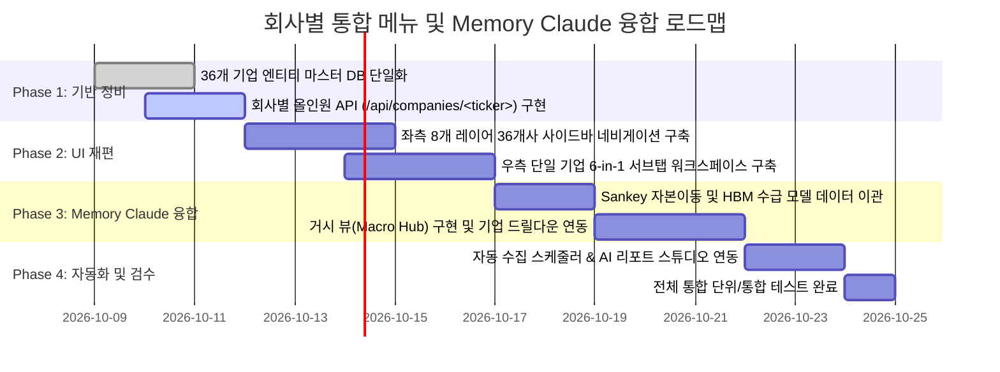
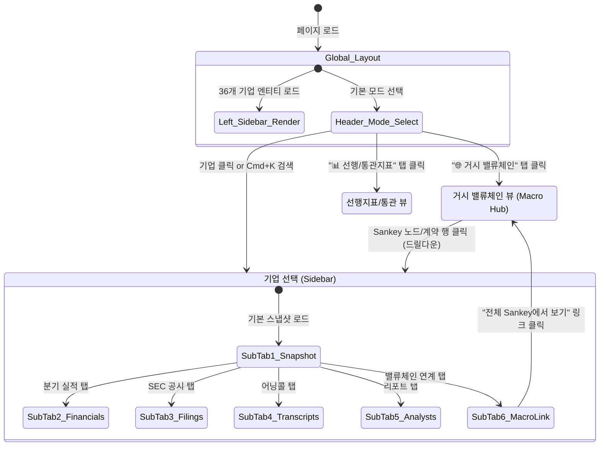

# [화면 요건정의서] 회사별 통합 인텔리전스 메뉴 & Memory Claude 거시 분석 융합

**문서 버전:** v1.0  
**작성일자:** 2026-10-08  
**대상 시스템:** `b_0917_10_QK_EARNING` (미시 공시·실적 파이프라인) × `b_0910_memory_claude` (거시 밸류체인·수급 시뮬레이터)  
**문서 목적:** 기능(기능별 탭) 중심의 현행 UI 구조를 **"회사별 올인원 워크스페이스(Company-Centric Workspace)"**로 전면 전환하고, `Memory Claude`의 핵심 거시 지표(Sankey 자본이동, HBM 수급 밸런스, 메가 계약, 팹/전력 캐파)를 통합 연계하는 차세대 화면 요건을 정의한다.

---

## 1. 개편 배경 및 핵심 목적

### 1.1 현행 시스템의 한계 (AS-IS)
1. **기능 중심 분절로 인한 높은 탐색 비용:**
   - 현재 화면은 `[개요]`, `[기업 목록]`, `[공시 아카이브]`, `[캘린더]`, `[컨센서스]`, `[분기 실적]`, `[컨퍼런스콜]`, `[애널리스트 리포트]` 등 기능 단위로 수평 나열되어 있습니다.
   - 특정 기업(예: **NVIDIA**, **SK하이닉스**)을 분석하려면 4~5개 이상의 서로 다른 탭을 반복해서 이동하며 필터를 재지정해야 합니다.
2. **거시(Macro)와 미시(Micro)의 단절:**
   - `b_0910_memory_claude`가 보유한 빅테크 CapEx 자본 흐름(Sankey), HBM 수급 밸런스, 팹/전력 캐파 등 거시적 AI 슈퍼사이클 엔진이 `b_0917_10_QK_EARNING`의 10-Q 공시 원문 및 10일 주기 통관 지표와 별도로 분리되어 있었습니다.

### 1.2 차세대 개편 방향 (TO-BE)
1. **회사별 1급 네비게이션 (Company-Centric First):**
   - 사용자가 언제든지 8대 레이어 36개 기업을 좌측 사이드바 또는 상단 셀렉터에서 즉시 선택할 수 있습니다.
   - 기업을 클릭하면 해당 기업의 **실적, 공시 원문, 어닝콜, 컨센서스, 목표주가, 공급망 관계**가 한곳에 집중된 **"단일 기업 종합 인텔리전스 허브"**가 펼쳐집니다.
2. **Memory Claude 거시 엔진의 완벽한 융합 (Top-Down ↔ Bottom-Up):**
   - 전체 밸류체인을 조망하는 **[거시 밸류체인 & 수급 사이클 (Macro Hub)]** 모드를 최상단에 제공합니다.
   - 거시 Sankey 다이어그램이나 HBM 수급 시뮬레이터에서 특정 기업 노드를 클릭하면 해당 기업의 상세 화면으로 즉시 드릴다운(Drill-down) 연결됩니다.

---

## 2. 화면 구조 및 네비게이션 설계 (IA)

### 2.1 듀얼 모드 구조
화면은 크게 **`[1. 글로벌 거시/산업 뷰]`**와 **`[2. 회사별 전용 인텔리전스 허브]`**의 2대 축으로 구성됩니다.

```text
[Global Header]
  ├── 시스템 로고 & 실시간 장전 스케줄러 상태
  ├── 모드 전환 탭: 
  │     [🌐 거시 밸류체인 & 슈퍼사이클 (Memory Claude)] 
  │     [📊 선행지표 & 통관 (관세청/GPU/스팟)] 
  │     [📅 어닝 캘린더 & D-Day] 
  │     [🤖 AI 리포트 스튜디오]
  └── 빠른 기업 검색 (Quick Switcher: Cmd+K / 티커 검색)

[Main Layout: 2-Column Split Workspace]
  ├── [Left Navigation Panel] : AI 반도체 밸류체인 8개 레이어 36개 기업 트리
  │     ├── L2 하이퍼스케일러 (7) : MSFT, GOOGL, AMZN, META, ORCL, CRWV, NBIS
  │     ├── L3 AI 가속기/컴퓨팅 (5) : NVDA, AMD, AVGO, ARM, INTC
  │     ├── L4 파운드리/장비 (7) : TSM, ASML, AMAT, LRCX, KLAC, ASX, AMKR
  │     ├── L5 메모리/스토리지 (5) : 000660.KS, 005930.KS, MU, WDC, 6600.T
  │     ├── L6 광통신/네트워킹 (3) : ANET, MRVL, COHR
  │     ├── L7 인프라/특수 (3) : AAPL, 9984.T, SPACEX
  │     └── L8 전력/에너지 (4) : VRT, ETN, GEV, SBGSF
  │
  └── [Right Main Workspace] : 선택된 기업의 6-in-1 종합 허브
        ├── Sub-Tab 1: 📊 기업 요약 & 핵심 KPI (Snapshot)
        ├── Sub-Tab 2: 📈 분기 실적 & Beat/Miss (10-Q/K 2020~현재)
        ├── Sub-Tab 3: 📑 SEC 공시 원문 & FTS 검색 (MD&A 분할 열람)
        ├── Sub-Tab 4: 🎙️ 어닝콜 트랜스크립트 (경영진 발언 & 질의응답)
        ├── Sub-Tab 5: 🎯 애널리스트 리포트 & 목표주가 (IB 컨센서스)
        └── Sub-Tab 6: 🔗 밸류체인 & 거시 수급 연계 (Memory Claude 모듈)
```

---

## 3. 화면별 세부 요건정의

---

### [화면 1] 좌측 기업 선택 네비게이션 패널 (Company Selector Sidebar)

| 항목 | 상세 화면 요건 |
| :--- | :--- |
| **위치/형태** | 좌측 고정 사이드바 (너비 280px, 접기/펼치기 Collapsible 지원) |
| **분류 체계** | 8개 레이어 순서(L2 → L3 → L4 → L5 → L6 → L7 → L8) 아코디언 트리 |
| **기업 항목 표기** | `[국기] [티커] [한글명] [실적 D-Day 뱃지]`<br>예: `🇺🇸 NVDA 엔비디아 (D-48)` / `🇰🇷 000660.KS SK하이닉스 (D-16)` |
| **상태 표시자** | • 다음 실적 발표 임박 시 D-Day 하이라이트 (`🔥 D-Day`, `⚡ D-7`)<br>• 최근 24시간 내 신규 공시/리포트 수집 시 알림 닷(Dot) 표기 |
| **검색 & 필터** | 상단에 실시간 필터 인풋 (`티커, 한글명, 영문명 초성 검색`) |
| **상호작용** | 기업 클릭 시 우측 메인 워크스페이스가 해당 기업의 데이터로 즉시 전환 (URL 해시 `#company/NVDA` 반영으로 뒤로가기/새로고침 상태 보존) |

---

### [화면 2] 회사별 통합 인텔리전스 허브 (Company Intelligence Hub)

특정 기업 선택 시 우측에 렌더링되는 전용 공간으로, 상단에 **헤더 요약 카드**와 **6개 세부 탭**으로 구성됩니다.

#### 2.1 상단 기업 프로필 & Quick KPI 헤더
* **회사 기본 정보:** 티커, 기업명(영문/한글), 소속 레이어 배지, 거래소, CIK, 결산월, 현재 주가 및 일간 변동률
* **실시간 4대 요약 카드:**
  1. **다음 실적 D-Day:** `D-Day` 카운트다운, 발표 예정일, 컨콜 예정 시간(ET)
  2. **최근 분기 매출 & OPM:** 최신 확정 매출액($/원), 전년동기 대비 성장률(YoY), 영업이익률
  3. **컨센서스 어닝 서프라이즈:** 최근 분기 Beat/Miss 결과 및 주가 반응(1일/5일 변동)
  4. **목표주가 컨센서스:** 글로벌 IB / 국내 증권사 평균 목표주가 및 현 주가 대비 상승여력(Upside)

#### 2.2 서브탭 1: 📊 기업 요약 & 스냅샷 (Company Snapshot)
* **내용:** 기업 비즈니스 개요, 핵심 사업부 매출 비중 파이차트, 90일 일별 주가 추이(OHLCV), 최근 뉴스 및 밸류체인 내 핵심 역할 정의.

 ---> 서브탭 추가 해서 회사별 중요뉴스 표시  로직은 /Users/boon/Dropbox/03_code 추가 

#### 2.3 서브탭 2: 📈 분기 실적 & Beat/Miss (Financials Intelligence)
* **2020~현재 장기 분기 시계열 테이블 & 차트:**
  - 매출액(Revenue), 영업이익(Operating Income), 순이익(Net Income), 설비투자(CapEx)
  - 사업 부문별 세부 매출 (예: 엔비디아 Datacenter vs Gaming, SK하이닉스 DRAM vs NAND)
* **컨센서스 대비 실적 서프라이즈 히트맵:**.  
  - 분기별 EPS / Revenue 컨센서스 vs 실제 확정치 비교, Beat/Inline/Miss 판정 및 1일/5일 주가 사후 반응 추적.
  ---> beat/miss 는 구현 필요 없음

#### 2.4 서브탭 3: 📑 SEC 공시 원문 & FTS 검색 (Filings & Text Intelligence)
* **공시 이력 테이블:** 해당 기업의 `10-K`, `10-Q`, `8-K` 목록 (제출일, 보고분기, 원문 상태 `DOWNLOADED`/`RECORDED`)
* **내장 원문 뷰어 & AI 분할 분석:**
  - 외부 링크 이동 없이 내부에서 원문 전문 열람
  - **Item 2 / Item 7 경영진 실적 분석(MD&A)** 요약 탭
  - **Item 1A 리스크 요인(Risk Factors)** 변경점 추적 탭
  - 문서 내 키워드 하이라이트 검색 (FTS5 연동)

#### 2.5 서브탭 4: 🎙️ 어닝콜 트랜스크립트 (Earnings Call Transcripts) 
* **분기별 컨퍼런스콜 타임라인:** 2024~2026 어닝콜 목록 (오디오 세션 시간, 분기 정보)
* **2분할 리더 뷰:**
  - 좌측: 경영진 발표(Prepared Remarks) vs 질의응답(Q&A) 화자별 발언 분할 목록
  - 우측: 발언 전문 열람, 핵심 제품 키워드(`Blackwell`, `HBM3E`, `CapEx`, `CoWoS` 등) 언급 횟수 및 문맥 하이라이트.
  -------> 일단은 제외  


#### 2.6 서브탭 5: 🎯 애널리스트 리포트 & 목표주가 (Analyst & IB Intelligence)
* **글로벌 IB 목표주가 히스토리 차트:** 골드만삭스, 모건스탠리, JP모건 등의 목표주가 상향/하향 추이 밴드
* **증권사 리포트 PDF 목록 & 전문 뷰어:**
  - 네이버 증권 등에서 크롤링된 정규 리포트 (발행일, 증권사, 작성자, 투자의견, 목표가)
  - PDF 원문 보기 및 백그라운드 추출 텍스트 검색.

#### 2.7 서브탭 6: 🔗 밸류체인 & 거시 수급 연계 (Memory Claude Integration)
* **해당 기업 중심 전후방 공급망 맵:**
  - **상류 공급사(Suppliers):** 전력/장비/파운드리 공급 업체 (예: NVDA의 공급사는 TSM, SK하이닉스, VRT)
  - **하류 고객사(Customers):** 클라우드 빅테크 고객 (예: NVDA의 고객은 MSFT, AMZN, GOOGL, META)
* **메가 계약($877B 장기 계약) 매핑:**
  - 해당 기업이 체결한 주요 AI 수주/공급 계약 내역, 계약 규모, 이행 분기
* **HBM & 팹/전력 캐파 기여도:**
  - HBM 점유율, TSMC CoWoS 웨이퍼 할당 비중, 데이터센터 전력 소비(MW) 현황.

---

### [화면 3] 거시 밸류체인 & 슈퍼사이클 뷰 (Macro Hub — Memory Claude Engine)

개별 기업 화면과 상호 보완되는 **"거시적 자본 흐름 및 중장기 수급 분석 전용 모드"**입니다. 상단 글로벌 네비게이션을 통해 언제든 진입할 수 있습니다.

| 세부 모듈 | 화면 기능 요건 | 상호작용 (기업 상세 연결) |
| :--- | :--- | :--- |
| **1. 레이어 간 자본 이동 (Sankey Diagram)** | • 빅테크 4대 하이퍼스케일러(L2)의 AI CapEx가 L3(가속기) → L4(파운드리) → L5(메모리) → L8(전력)로 흘러 들어가는 자본 흐름 시각화<br>• 연도별/분기별(2024~2026) 금액($B) 워터폴 | Sankey 노드(기업명) 클릭 시 해당 기업의 **[분기 실적 & CapEx]** 화면으로 즉시 이동 |
| **2. HBM 수급 밸런스 시뮬레이터** | • HBM3E/HBM4 수요(NVIDIA, AMD 가속기 탑재량) vs 공급(SK하이닉스, 삼성전자, 마이크론 캐파) 비교 차트<br>• 공급 부족(Shortage)에서 과잉(Glut)으로 전환되는 크로스오버 시점 예측 | SK하이닉스/삼성전자/마이크론 클릭 시 **[밸류체인 & 수급]** 탭으로 연결 |
| **3. 메가 계약 트래커 ($877B Mega Contracts)** | • AI 가속기 및 클라우드 장기 공급 계약 15건의 타임라인 및 분기별 매출 인식 현황<br>• 공급자(Vendor)와 구매자(Buyer) 관계 테이블 | 계약 행 클릭 시 양사(공급사/구매사) 비교 화면 노출 |
| **4. 팹 & 전력 캐파 모니터링** | • TSMC CoWoS 생산능력(k/월), 글로벌 선단공정 웨이퍼 캐파<br>• 미국/유럽 데이터센터 전력 확보 현황(GW) 및 원전/SMR 연계 지표 | 관련 기업(TSM, VRT, ETN, GEV) 바로가기 제공 |

---

### [화면 4] 선행지표 & 통관 분석 뷰 (Leading Indicators Hub)

1. **관세청 10일 주기 반도체 수출입 통계 (UNIPASS):**
   - 매월 1일, 11일, 21일 통관 잠정치 자동 갱신
   - HS 8542.31(프로세서/가속기), HS 8542.32(메모리/HBM) 전년동기 대비(YoY) 증감률 및 조업일수 조정 추이
2. **글로벌 메모리 스팟 가격:**
   - DRAM (DDR5, DDR4), NAND Flash 일별 스팟 가격 추이 및 계약가 갭 분석
3. **GPU 클라우드 렌탈 스팟 가격:**
   - RunPod, Lambda Labs, Vast.ai 등 H100 SXM, H200, B200 인스턴스 시간당 임대료($/hr) 및 가용성(Availability) 실시간 트래커

---

### [화면 5] AI 크로스 리포트 스튜디오 (AI Report Studio)

* **원클릭 다차원 보고서 생성:**
  1. **단일 기업 심층 실적 브리프:** 선택한 기업의 최근 10-Q 재무 수치 + MD&A 경영진 코멘트 + IB 목표가 융합 보고서
  2. **밸류체인 낙수효과 리포트:** L2 하이퍼스케일러 CapEx 증가율이 L3 엔비디아와 L5 SK하이닉스 매출에 미치는 시차 분석 보고서
  3. **HBM 슈퍼사이클 전망 리포트:** 10일 통관 데이터 + HBM 수급 밸런스 기반 차기 분기 실적 사전 예측 보고서

 ------- (일단 제외) --------   

---

## 4. 데이터베이스 및 백엔드 통합 요건

### 4.1 SQLite 통합 데이터 모델 (`data/qk_earning.db`)

기존 `10_QK_EARNING`의 스키마에 `Memory Claude`의 거시 분석 테이블을 완전 병합합니다.

```sql
-- 1. 통합 엔티티 마스터 (36개사)
CREATE TABLE IF NOT EXISTS entity (
    id INTEGER PRIMARY KEY AUTOINCREMENT,
    ticker TEXT UNIQUE NOT NULL,
    name_en TEXT NOT NULL,
    name_ko TEXT NOT NULL,
    layer_code TEXT NOT NULL,        -- L2_HYPERSCALER ~ L8_POWER
    exchange TEXT,
    sec_cik TEXT,
    country TEXT,
    fiscal_year_end TEXT DEFAULT '12'
);

-- 2. 미시 데이터 (공시, 텍스트, 재무, 컨센서스)
-- filing, filing_fts, financial_metric, consensus, earning_calendar, stock_price (기존 유지)

-- 3. 거시 데이터 (Memory Claude 이관)
CREATE TABLE IF NOT EXISTS mega_contracts (
    id INTEGER PRIMARY KEY AUTOINCREMENT,
    buyer_ticker TEXT NOT NULL,
    supplier_ticker TEXT NOT NULL,
    contract_title TEXT NOT NULL,
    total_value_usd REAL,            -- 계약 총액 (단위: 백만 달러)
    announcement_date TEXT,
    duration_years REAL,
    status TEXT DEFAULT 'ACTIVE',    -- ACTIVE, COMPLETED, PENDING
    notes TEXT
);

CREATE TABLE IF NOT EXISTS fab_capacity (
    id INTEGER PRIMARY KEY AUTOINCREMENT,
    entity_id INTEGER NOT NULL,
    quarter_str TEXT NOT NULL,       -- 예: '2026-Q1'
    process_node TEXT NOT NULL,      -- 예: '3nm', 'CoWoS-S', 'HBM3E'
    capacity_wpm INTEGER,            -- Wafer Per Month
    utilization_rate REAL,           -- 가동률 (%)
    FOREIGN KEY(entity_id) REFERENCES entity(id)
);

CREATE TABLE IF NOT EXISTS datacenter_power (
    id INTEGER PRIMARY KEY AUTOINCREMENT,
    region TEXT NOT NULL,
    total_gw REAL,
    ai_share_pct REAL,
    recorded_year INTEGER
);
```

### 4.2 신규 회사 중심 REST API 명세

| Method | Endpoint | 설명 |
| :--- | :--- | :--- |
| `GET` | `/api/companies/<ticker>/full` | 기업 기본정보, 최근 실적, 공시 요약, D-Day, 컨센서스, 목표주가 올인원 패키지 반환 |
| `GET` | `/api/companies/<ticker>/financials` | 2020~현재 장기 분기 재무 시계열 및 부문별 매출 |
| `GET` | `/api/companies/<ticker>/filings` | 해당 기업의 10-Q, 10-K, 8-K 공시 목록 및 FTS 검색 |
| `GET` | `/api/companies/<ticker>/transcripts` | 해당 기업의 어닝콜 트랜스크립트 목록 및 화자별 본문 |
| `GET` | `/api/companies/<ticker>/analysts` | 목표주가 변동 히스토리 및 네이버 증권 PDF 목록 |
| `GET` | `/api/companies/<ticker>/macro-links` | 해당 기업의 공급망 전후방 연결, 체결 메가계약, 캐파 데이터 |
| `GET` | `/api/macro/sankey` | L2~L8 자본 이동 Sankey 다이어그램 노드 및 링크 데이터 |
| `GET` | `/api/macro/hbm-balance` | 2024~2028 HBM 수요/공급 밸런스 시계열 데이터 |
| `GET` | `/api/macro/contracts` | $877B AI 메가 계약 목록 및 이행 상태 |

---

## 5. UI/UX 디자인 및 반응형 레이아웃 요건

### 5.1 레이아웃 원칙
* **다크 모던 프리미엄 테마:** 기존의 딥 네이비/차콜 배경(`--bg-primary: #0F172A`), HSL 테일러드 엑센트(Cyan, Emerald, Violet) 유지.
* **접이식 사이드바 (Collapsible Sidebar):** 화면 폭이 좁거나 본문 원문 열람 시 좌측 기업 목록을 아이콘 모드로 축소하여 뷰어 영역을 최대 100%까지 확장 가능.
* **단축키 및 퀵 스위처:**
  - `Cmd + K` 또는 키보드 `/` 입력 시 글로벌 기업 검색 팝업 활성화 → 티커 입력 후 Enter로 즉시 이동.
  - `[` / `]` 키로 이전/다음 기업으로 순차 이동.
* **URL 라우팅 & 상태 복원:**
  - `window.location.hash = #company/NVDA/financials`와 같이 주소창에 선택 기업과 서브탭 상태를 반영하여 브라우저 '뒤로 가기' 및 북마크가 완벽히 동작하도록 구현.

---

## 6. 단계별 구현 로드맵 (Action Plan)



### Phase 1: DB 스키마 단일화 & 회사별 REST API 구축 (Day 1~3)
- `b_0910_memory_claude`의 메가계약(15건), 팹/전력 캐파 데이터를 `data/qk_earning.db`로 이전
- 특정 기업 티커를 인자로 받아 재무+공시+트랜스크립트+리포트를 일괄 리턴하는 `/api/companies/<ticker>/full` 엔드포인트 작성

### Phase 2: 프론트엔드 네비게이션을 '회사 중심'으로 전면 개편 (Day 4~7)
- `static/index.html` 및 `static/js/app.js` 개편:
  - 기존 10개 수평 탭을 헤더의 모드 전환(거시 뷰 / 선행지표 / 캘린더)으로 압축
  - 좌측에 L2~L8 36개 기업 사이드바 배치
  - 우측에 선택 기업의 6개 서브탭 워크스페이스 구축

### Phase 3: Memory Claude 거시 모듈 UI 탑재 (Day 8~11)
- D3.js / Chart.js 기반의 L2~L8 자본 이동 Sankey 다이어그램 포팅
- HBM 수요/공급 크로스오버 시뮬레이터 차트 탑재
- 거시 노드 클릭 ↔ 기업 허브 전환 상호작용 연결

### Phase 4: AI 통합 리포트 스튜디오 & 안정화 (Day 12~14)
- 개별 기업 1차 원문(10-Q MD&A)과 거시 밸류체인 수급 분석을 종합하는 AI 리포트 생성기 연동
- 단위 및 회귀 테스트 수행

---

## 7. 기대 효과

1. **투자·리서치 생산성 극대화:** 탭 전환 없이 한 화면에서 특정 기업의 재무, 공시 원문, 컨콜 발언, 증권사 리포트를 즉시 비교 분석 가능.
2. **거시(Top-down)와 미시(Bottom-up)의 결합:** 빅테크 자본 지출(CapEx)의 흐름이 실제 반도체 파운드리와 메모리 기업의 수주/매출로 연결되는 과정을 한 플랫폼에서 완전 검증 가능.
3. **확장성 확보:** 향후 새로운 AI 밸류체인 기업이 추가되더라도 좌측 레이어 트리에 자동 등록되어 즉시 동일한 6개 인텔리전스 뷰를 누릴 수 있음.

---

## 8. 화면 시각 스케치 및 와이어프레임 (UI Visual Wireframes)


## 1. 전체 화면 기본 프레임워크 (Global Layout Structure)

전체 화면은 **[상단 글로벌 헤더]**와 좌측 **[36개 기업 네비게이터 사이드바]**, 우측 **[메인 워크스페이스]**의 2분할 스플릿 구조를 취합니다.

```text
┌────────────────────────────────────────────────────────────────────────────────────────────────────────────────────────┐
│ 📈 QK_EARNING × Memory Claude  │ 🌐 거시 밸류체인   📊 선행/통관지표   📅 어닝 캘린더   🤖 리포트 스튜디오 │ ⏰ 08:00 자동수집 가동중 │ 🔍 [Cmd+K] 기업 검색 │
├────────────────────────────────┴───────────────────────────────────────────────────────────────────────────────────────┴──────────────────────┤
│ ◀ [접기]                                                                                                                                       │
│                                │                                                                                                               │
│ ┌── 🏢 밸류체인 기업 (36) ─────┐ │ ┌── [🏢 NVDA] NVIDIA Corp. · 엔비디아 ───────────────────────────────────────── 🇺🇸 NASDAQ · L3 AI가속기 · CIK:0001045810 ──┐ │
│ │ 🔍 티커/기업명 필터...       │ │ │ $138.25  ▲ +3.42% (+4.57)  │ 다음 실적: 2026-11-25 (D-48) │ OPM: 62.8% │ 목표가: $165.00 (+19.3% Upside) │ │
│ ├──────────────────────────────┤ │ ├───────────────────────────────────────────────────────────────────────────────────────────────────────────┤
│ │ ▼ L2 하이퍼스케일러 (7)      │ │ │ [ 📊 기업 요약 ] [ 📈 분기 실적(10-Q) ] [ 📑 SEC 공시 원문 ] [ 🎙️ 어닝콜 ] [ 🎯 애널리스트 ] [ 🔗 밸류체인·Memory ]    │ │
│ │   🇺🇸 MSFT 마이크로소프트 ⚡D-7│ │ ├───────────────────────────────────────────────────────────────────────────────────────────────────────────┤
│ │   🇺🇸 GOOGL 알파벳(구글)      │ │ │                                                                                                           │
│ │   🇺🇸 AMZN 아마존             │ │ │                                                                                                           │
│ │   🇺🇸 META 메타        🔥D-Day │ │ │                                                                                                           │
│ │   🇺🇸 ORCL 오라클             │ │ │                                 [ 선택된 서브탭별 상세 작업 영역 (메인 뷰) ]                                  │
│ │   🇺🇸 CRWV 코어위브           │ │ │                                                                                                           │
│ │   🇳🇱 NBIS 네비우스           │ │ │                                                                                                           │
│ ├──────────────────────────────┤ │ │                                                                                                           │
│ │ ▼ L3 AI 컴퓨팅/가속기 (5)    │ │ │                                                                                                           │
│ │ ▶ 🇺🇸 NVDA 엔비디아    (D-48) │ │ │                                                                                                           │
│ │   🇺🇸 AMD  AMD                │ │ │                                                                                                           │
│ │   🇺🇸 AVGO 브로드컴           │ │ │                                                                                                           │
│ │   🇬🇧 ARM  Arm                │ │ │                                                                                                           │
│ │   🇺🇸 INTC 인텔               │ │ │                                                                                                           │
│ ├──────────────────────────────┤ │ │                                                                                                           │
│ │ ▶ L4 파운드리/장비 (7)       │ │ │                                                                                                           │
│ │ ▶ L5 메모리/스토리지 (5)     │ │ │                                                                                                           │
│ │ ▶ L6 광통신/네트워킹 (3)     │ │ │                                                                                                           │
│ │ ▶ L7 인프라/특수 (3)         │ │ │                                                                                                           │
│ │ ▶ L8 전력/에너지 인프라 (4)  │ │ │                                                                                                           │
│ └──────────────────────────────┘ │ └───────────────────────────────────────────────────────────────────────────────────────────────────────────┘ │
└────────────────────────────────────────────────────────────────────────────────────────────────────────────────────────────────────────────────┘
```

---

## 2. 화면 스케치: 회사별 통합 허브 (Company Intelligence Hub)

특정 기업(예: **NVDA**)을 선택했을 때 우측 메인 영역에 나타나는 6개 서브탭 상세 스케치입니다.

---

### 2.1 [서브탭 1] 📊 기업 요약 & 스냅샷 (Company Snapshot)

```text
┌── [상단 Quick KPI 카드 4종] ──────────────────────────────────────────────────────────────────────────────────────────────┐
│ ┌─────────────────────────┐ ┌─────────────────────────┐ ┌─────────────────────────┐ ┌─────────────────────────┐ │
│ │ ⏳ 다음 실적 카운트다운   │ │ 💰 최근 분기 총매출     │ │ 🎯 최근 분기 Beat/Miss   │ │ 🎯 IB 평균 목표주가     │ │
│ │        D-48             │ │        $39.5B           │ │      BEAT (+4.8%)       │ │        $165.00          │ │
│ │ 2026-11-25 17:00 ET     │ │ YoY +122.0% (OPM 62.8%) │ │ EPS $0.78 (컨센 $0.74)  │ │ 34개 IB 종합 (상승 +19.3%)│ │
│ └─────────────────────────┘ └─────────────────────────┘ └─────────────────────────┘ └─────────────────────────┘ │
└─────────────────────────────────────────────────────────────────────────────────────────────────────────────────────┘

┌── [좌: 90일 일별 주가 추이 (OHLCV)] ────────────────────┐ ┌── [우: 사업 부문별 매출 비중 & 밸류체인 포지션] ───────┐
│ [Chart: NVDA 90-Day Trend]                              │ │ [매출 비중 파이 차트]                                   │
│  $140 ┤              ╭───╮                              │ │  ████████████████████░░░░░░  데이터센터 (87.5%, $34.5B) │
│  $130 ┤        ╭─────╯   ╰─╮      ╭── (현재 $138.25)     │ │  ███░░░░░░░░░░░░░░░░░░░░░░░  게이밍 (8.2%, $3.2B)       │
│  $120 ┤    ╭───╯           ╰──────╯                     │ │  █░░░░░░░░░░░░░░░░░░░░░░░░░  프로페셔널/오토 (4.3%)      │
│  $110 ┤╭───╯                                            │ ├───────────────────────────────────────────────────────┤
│       └┬─────────┬─────────┬─────────┬─────────┬─────── │ │ 🌐 밸류체인 내 핵심 포지션:                            │
│       08/01     08/15     09/01     09/15     10/01     │ │  • L3 AI 가속기 시장 점유율 88% 지배                    │
│ [거래량: ||||| | |||||| |||| |||||||| ||||| ||||||| ]   │ │  • 주요 공급선: TSM(3nm CoWoS), SK하이닉스(HBM3E), VRT│
│                                                         │ │  • 주요 고객사: MSFT(21%), META(13%), AMZN, GOOGL     │
└─────────────────────────────────────────────────────────┘ └───────────────────────────────────────────────────────┘
```

---

### 2.2 [서브탭 2] 📈 분기 실적(10-Q/K) & Beat/Miss 시계열

```text
┌── 📈 2020~2026 장기 분기 실적 추이 (매출액 & 영업이익 & CapEx) ────────────────────────────────────────────────────────┐
│  $40B ┤                                                 [■ 매출액  ■ 영업이익  ■ 설비투자(CapEx)]                     │
│  $30B ┤                                           ╭───╮                                                               │
│  $20B ┤                                     ╭───╮ │   │                                                               │
│  $10B ┤ ╭─╮ ╭─╮ ╭─╮ ╭─╮ ╭─╮ ╭─╮ ╭─╮ ╭─╮ ╭─╮ │   │ │   │                                                               │
│   $0B ┴─┴─┴─┴─┴─┴─┴─┴─┴─┴─┴─┴─┴─┴─┴─┴─┴─┴─┴─┴───┴─┴───┴───────────────────────────────────────────────────────────────┤
│        22Q1  22Q3  23Q1  23Q3  24Q1  24Q3  25Q1  25Q3  26Q1  26Q2                                                     │
└───────────────────────────────────────────────────────────────────────────────────────────────────────────────────────┘

┌── 📋 10-Q / 10-K 공시 연계 분기 재무 테이블 ──────────────────────────────────────────────────────────────────────────┐
│ 분기     │ 공시종류 │ 실적발표일 │ 총매출액    │ YoY 성장률 │ 영업이익    │ 영업이익률 │ EPS(실제/컨센) │ 서프라이즈 │ 주가반응(1D/5D)│
├──────────┼──────────┼────────────┼─────────────┼────────────┼─────────────┼────────────┼────────────────┼────────────┼────────────────┤
│ 2026-Q2  │ 10-Q     │ 2026-08-26 │ $39,520M    │ +122.0%    │ $24,820M    │ 62.8%      │ $0.78 / $0.74  │ 🟢 Beat+5% │ ▲+4.2% / +7.8% │
│ 2026-Q1  │ 10-Q     │ 2026-05-20 │ $26,044M    │ +262.1%    │ $16,909M    │ 64.9%      │ $0.61 / $0.56  │ 🟢 Beat+9% │ ▲+9.3% /+15.2% │
│ 2025-Q4  │ 10-K     │ 2026-02-21 │ $22,103M    │ +265.3%    │ $13,615M    │ 61.6%      │ $0.51 / $0.46  │ 🟢 Beat+11%│ ▲+16.4%/+22.1% │
│ 2025-Q3  │ 10-Q     │ 2025-11-20 │ $18,120M    │ +205.5%    │ $10,417M    │ 57.5%      │ $0.40 / $0.34  │ 🟢 Beat+18%│ ▲+2.1% / -1.5% │
└──────────┴──────────┴────────────┴─────────────┴────────────┴─────────────┴────────────┴────────────────┴────────────┴────────────────┘
```

---

### 2.3 [서브탭 3] 📑 SEC 공시 원문 & FTS 텍스트 뷰어

```text
┌── 📑 SEC 정기/수시 공시 목록 ───────────────────────────────────────────┬── 🔍 FTS5 전문 검색 & MD&A 인텔리전스 ───────────────┐
│ 필터: [모든 양식(All) ▼] [검색어: Blackwell            ]                │ 🎙️ NVDA 2026-Q2 (10-Q) 경영진 실적 분석 (MD&A)      │
├─────────┬───────┬────────────┬───────────┬────────────┬─────────────────┤ ┌───────────────────────────────────────────────────┐ │
│ 보고서  │ 분기  │ 제출일자   │ 상태      │ 원문 파일  │ 액션            │ │ [ MD&A 요약 ] [ 리스크 요인(1A) ] [ 원문 전문 ]   │ │
├─────────┼───────┼────────────┼───────────┼────────────┼─────────────────┤ ├───────────────────────────────────────────────────┤ │
│ 10-Q    │ 26-Q2 │ 2026-08-26 │DOWNLOADED │ 18.2 MB    │ [선택됨]        │ │ ■ 데이터센터 부문 성과 (Item 2)                  │ │
│ 8-K     │ 26-Q2 │ 2026-08-26 │DOWNLOADED │  1.4 MB    │ [열람]          │ │   데이터센터 매출액은 $34.5B로 전년동기 대비      │ │
│ 10-Q    │ 26-Q1 │ 2026-05-20 │DOWNLOADED │ 17.5 MB    │ [열람]          │ │   154% 증가함. Hopper 아키텍처에 대한 수요가     │ │
│ 10-K    │ 25-FY │ 2026-02-21 │DOWNLOADED │ 42.1 MB    │ [열람]          │ │   견고하게 유지되었으며, Blackwell 샘플 출하가    │ │
│ 8-K     │ 25-Q4 │ 2026-01-08 │RECORDED   │  -         │ [⚡다운로드]    │ │   본격 개시됨.                                    │ │
└─────────┴───────┴────────────┴───────────┴────────────┴─────────────────┘ │                                                   │ │
                                                                            │ ■ 공급망 제약 및 패키징 코멘트                     │ │
                                                                            │   "CoWoS-L 첨단 패키징 및 HBM3E 공급 능력 확대를   │ │
                                                                            │   위해 TSMC 및 주요 메모리 파트너사와 긴밀히 협력..."│ │
                                                                            │                                                   │ │
                                                                            │ [ 🔗 SEC 공식 원문(HTML) 새창 열기 ↗ ] [ 📋 복사 ] │ │
                                                                            └───────────────────────────────────────────────────┘ │
                                                                            └─────────────────────────────────────────────────────┘
```

---

### 2.4 [서브탭 4] 🎙️ 어닝콜 트랜스크립트 2분할 뷰어

```text
┌── 🎧 컨퍼런스콜 분기 선택 & 필터 ──────────────────────────────────────┬── 📖 트랜스크립트 세션별 리더 (Speaker & Remarks) ───┐
│ [ 2026-Q2 어닝콜 ▼ ]  일자: 2026-08-26 17:00 ET                         │ 🎙️ Jensen Huang (President & CEO)                   │
│ 🔍 키워드 검색: [ HBM3E                ] (언급 24회)                   │ ─────────────────────────────────────────────────── │
├────────────────────────────────────────────────────────────────────────┤ "Blackwell architecture customer demand is          │
│ 세션 목록:                                                             │  unprecedented, well exceeding available supply.    │
│  ● 00:00 - 18:20  [경영진 발표] Colette Kress (CFO)                    │  We are scaling volume production with TSMC and     │
│  ● 18:21 - 32:45  [경영진 발표] Jensen Huang (CEO) [선택]              │  our memory partner <mark>HBM3E</mark> shipments    │
│  ● 32:46 - 41:10  [Q&A #1] Toshiya Hari (Goldman Sachs)                │  are ramping steeply into the second half..."       │
│  ● 41:11 - 48:30  [Q&A #2] Stacy Rasgon (Bernstein)                    │                                                     │
│  ● 48:31 - 56:00  [Q&A #3] Timothy Arcuri (UBS)                        │ ─────────────────────────────────────────────────── │
│  ● 56:01 - 62:15  [Q&A #4] Vivek Arya (BofA)                           │ ❓ Q&A: Toshiya Hari (Goldman Sachs)                │
│                                                                        │ "Could you elaborate on the margin trajectory as    │
│ [핵심 언급 버즈워드]:                                                  │  Blackwell ramps versus Hopper?"                    │
│  #Blackwell(48)  #HBM3E(24)  #SovereignAI(15)  #CapEx(32)              │                                                     │
└────────────────────────────────────────────────────────────────────────┴─────────────────────────────────────────────────────┘
```

---

### 2.5 [서브탭 5] 🎯 애널리스트 리포트 & 목표주가 인텔리전스

```text
┌── 🎯 글로벌 IB 목표주가 변동 히스토리 차트 ──────────────────────────────┬── 📄 국내외 증권사 정규 리포트 (PDF 원문 뷰어) ──────┐
│  $180 ┤                                           ╭─── [Goldman $175]   │ ┌───────────────────────────────────────────────────┐ │
│  $160 ┤                             ╭─────────────╯     [Morgan $168]   │ │ 발행일    │ 증권사      │ 작성자   │ 투자의견│ 목표가  │ │
│  $140 ┤                 ╭───────────╯                   [Citi $160]     │ ├───────────┼─────────────┼──────────┼─────────┼─────────┤ │
│  $120 ┤     ╭───────────╯                                               │ │ 2026-09-02│ 미래에셋증권│ 김영건   │ BUY     │ $165.00 │ │
│  $100 ┤ ╭───╯                                   [현재가: $138.25]       │ │ 2026-08-28│ 하나증권    │ 록키리   │ BUY     │ $170.00 │ │
│       └┬──────────┬──────────┬──────────┬──────────┬──────────┬──────── │ │ 2026-08-27│ GoldmanSachs│ T.Hari   │ Conv.BUY│ $175.00 │ │
│       25-Q1      25-Q2      25-Q3      25-Q4      26-Q1      26-Q2      │ │ 2026-08-27│ MorganSt.   │ J.Moore  │ Overwt  │ $168.00 │ │
│                                                                        │ └───────────────────────────────────────────────────┘ │
│ 종합 컨센서스: BUY (매수 32건, 보유 2건, 매도 0건) / 평균 $165.00 (+19.3%)│ [ 📄 선택 리포트 요약 & PDF 뷰어 다운로드 버튼 ]     │
└────────────────────────────────────────────────────────────────────────┴───────────────────────────────────────────────────────┘
```

---

### 2.6 [서브탭 6] 🔗 밸류체인 & 거시 수급 연계 (Memory Claude Integration)

```text
┌── 🌐 엔비디아 중심 공급망 관계 맵 (Suppliers & Customers) ──────────────┬── 💰 메가 계약 및 HBM/캐파 기여도 (Memory Claude) ───┐
│                                                                        │ ┌── 📜 $877B AI 메가 계약 연계 ───────────────────────┐ │
│   [ 상류 공급사: Upstream ]                                            │ │ • MSFT 클라우드 공급 계약: $12.5B (2025~2026)       │ │
│   ├─ 파운드리/패키징 : [TSM] TSMC (3nm Wafer & CoWoS-L 독점)           │ │ • AWS UltraServer 클러스터 계약: $9.8B (진행중)     │ │
│   ├─ 고대역폭 메모리 : [000660.KS] SK하이닉스 (HBM3E 메인 75%)         │ │ • Meta AI MTIA 보완 B200 10만장 공급 계약          │ │
│   ├─ 전력 인프라     : [VRT] 버티브 홀딩스 (액체냉각 CDU 독점 공급)    │ └─────────────────────────────────────────────────────┘ │
│                                                                        │                                                         │
│                               ▼                                        │ ┌── ⚖️ HBM 시장 소비 비중 ────────────────────────────┐ │
│                       ★ [NVDA] 엔비디아 ★                               │ │ 엔비디아 H200/B200 소비량: 글로벌 HBM 생산의 82% 점유 │ │
│                               │                                        │ │   SK하이닉스 공급분  : ██████████████░░░░░ (72%)    │ │
│                               ▼                                        │ │   마이크론 공급분    : ████░░░░░░░░░░░░░░ (18%)    │ │
│   [ 하류 고객사: Downstream Hyperscalers ]                             │ │   삼성전자 품질인증  : ██░░░░░░░░░░░░░░░░ (10%)    │ │
│   ├─ [MSFT] 마이크로소프트 (CapEx의 38% NVDA GPU 구매 할당)            │ └─────────────────────────────────────────────────────┘ │
│   ├─ [META] 메타 플랫폼 (Llama 4 학습용 20만장 클러스터 구축)          │                                                         │
│   ├─ [AMZN] 아마존 AWS / [GOOGL] 구글 GCP / [CRWV] 코어위브            │ [ 🌐 거시 자본흐름(Sankey)에서 NVDA 위치 확인하기 → ]    │
└────────────────────────────────────────────────────────────────────────┴─────────────────────────────────────────────────────────┘
```

---

## 3. 화면 스케치: 거시 밸류체인 대시보드 (Macro Hub — Memory Claude)

상단 메뉴의 **`[🌐 거시 밸류체인 & 슈퍼사이클]`** 모드를 클릭했을 때 펼쳐지는 전체 밸류체인 통합 관제 화면입니다.

---

### 3.1 레이어 간 자본 이동 흐름 (Sankey Diagram Wireframe)

```text
┌── 🌊 2026 AI 반도체 밸류체인 자본 흐름 (Sankey Flow: L2 하이퍼스케일러 CapEx → L8 전력) ───────────────────────────────┐
│                                                                                                                           │
│   [ L2 하이퍼스케일러 CapEx ]        [ L3 AI 칩/가속기 ]          [ L4 파운드리/패키징 ]       [ L5 메모리/HBM ]          │
│   ┌────────────────────────┐                                                                                              │
│   │ MSFT   $58B            │─────╮                                                                                        │
│   ├────────────────────────┤     │                                                                                        │
│   │ META   $42B            │─────┼───► ┌───────────────┐                                                                  │
│   ├────────────────────────┤     │     │ NVDA   $110B  │─────────► ┌───────────────┐                                     │
│   │ GOOGL  $48B            │─────┤     │ (엔비디아)    │           │ TSM    $42B   │────────► ┌───────────────┐              │
│   ├────────────────────────┤     │     └───────────────┘           │ (파운드리)    │          │ SK하이닉스$28B│ (HBM3E 독점)  │
│   │ AMZN   $65B            │─────╯                                 └───────────────┘          ├───────────────┤              │
│   └────────────────────────┘             ┌───────────────┐                                    │ 삼성전자 $18B │              │
│       (총 $213B CapEx)                   │ AMD/기타 $18B │                                    ├───────────────┤              │
│                                          └───────────────┘                                    │ 마이크론  $9B │              │
│                                                  │                                            └───────────────┘              │
│                                                  ╰───────────────────────────────────────────────────▲                       │
│                                                                                                      │                       │
│   [ L8 전력/냉각 인프라 낙수효과 ] ──────────────────────────────────────────────────────────────────╯                       │
│   ┌──────────────────────────────────────────────────────────────────────────────────────────────────────────┐            │
│   │ VRT(버티브) $4.2B  │  ETN(이튼) $5.1B  │  GEV(GE버노바) $6.8B  (데이터센터 전력 증설 CapEx 수혜 +35% YoY) │            │
│   └──────────────────────────────────────────────────────────────────────────────────────────────────────────┘            │
│                                                                                                                           │
│   💡 [상호작용]: 위 다이어그램의 어떤 노드(기업 박스)라도 클릭하면 해당 기업의 [분기 실적 및 공시 허브]로 즉시 이동합니다! │
└───────────────────────────────────────────────────────────────────────────────────────────────────────────────────────────┘
```

---

### 3.2 HBM 수급 밸런스 & 슈퍼사이클 시뮬레이터 (Supply-Demand Balance)

```text
┌── ⚖️ 2024~2028 HBM 비트 수요 vs 공급 크로스오버 시뮬레이션 (Memory Claude Engine) ────────────────────────────────────────┐
│  Bit(M)                                                                                                                   │
│   1000 ┤                                                                         ╭── [HBM 공급 캐파 (SK/삼성/MU)]         │
│    800 ┤                                                           ╭─────────────╯                                        │
│    600 ┤                                             ╭─────────────╯    ⚡ [크로스오버 시점: 2027-Q2 공급과잉 전환 예측]  │
│    400 ┤                               ╭─────────────╯ ═════════════════ (수요 곡선: Blackwell/Rubin 가속기 탑재량)       │
│    200 ┤                 ╭─────────────╯ ════════════                                                                     │
│      0 ┴─────────────────┴───────────────────────────┴─────────────┴─────────────┴────────────────────────────────────────┤
│             2024-Q4           2025-Q2           2025-Q4           2026-Q2           2026-Q4           2027-Q2                 │
│         [공급부족 -35%]   [공급부족 -22%]   [공급부족 -14%]   [공급부족 -8%]    [수급균형 0%]     [공급과잉 +7%]         │
├───────────────────────────────────────────────────────────────────────────────────────────────────────────────────────────┤
│ 📊 시뮬레이션 시나리오 파라미터 조절:                                                                                     │
│  • 빅테크 AI CapEx 성장률  : [ +35% YoY ▼ ]     • 칩당 HBM 탑재 용량(B200: 192GB) : [ 표준 채택 ▼ ]                       │
│  • TSMC CoWoS 웨이퍼 캐파 : [ 45k/월 ▼ ]       • 삼성전자 HBM3E 납품 본격화 시점  : [ 2026-Q3 ▼ ]                        │
│  ▶ [ 🔄 시뮬레이션 재계산 ]  [ 💾 시나리오 저장 ]                                                                         │
└───────────────────────────────────────────────────────────────────────────────────────────────────────────────────────────┘
```

---

## 4. 화면 스케치: 단축키 퀵 서처 모달 (Quick Switcher Modal — Cmd + K)

작업 도중 마우스 이동 없이 키보드로 즉시 원하는 기업의 특정 탭으로 이동할 수 있는 글로벌 팝업입니다.

```text
┌────────────────────────────────────────────────────────────────────────────────┐
│                                                                                │
│   ┌── 🔍 이동할 기업 또는 메뉴 검색... (Esc로 닫기) ─────────────────────────┐  │
│   │ nv                                                                      │  │
│   ├─────────────────────────────────────────────────────────────────────────┤  │
│   │ [기업 바로가기]                                                         │  │
│   │  ▶ 🇺🇸 NVDA (엔비디아) — L3 AI 가속기  (실적 D-48)              [Enter]   │  │
│   │                                                                         │  │
│   │ [NVDA 세부 화면으로 직행]                                               │  │
│   │  ↳ 📈 NVDA 10-Q/K 분기 재무제표 & Beat/Miss                    [Tab+1]  │  │
│   │  ↳ 📑 NVDA SEC 공시 원문 & MD&A 뷰어                           [Tab+2]  │  │
│   │  ↳ 🎙️ NVDA 2026-Q2 어닝콜 트랜스크립트                         [Tab+3]  │  │
│   │  ↳ 🔗 NVDA 밸류체인 & 공급망 관계도                            [Tab+4]  │  │
│   │                                                                         │  │
│   │ [최근 검색 기록]                                                        │  │
│   │  • 🇰🇷 000660.KS (SK하이닉스) - 실적 D-16                               │  │
│   │  • 🇹🇼 TSM (TSMC) - 실적 D-8                                            │  │
│   │  • 🌐 거시 자본흐름 Sankey 다이어그램                                    │  │
│   └─────────────────────────────────────────────────────────────────────────┘  │
│                                                                                │
└────────────────────────────────────────────────────────────────────────────────┘
```

---

## 5. UI 인터랙션 및 상태 전이 흐름도



---

## 6. 요약 및 체크리스트

| 검수 영역 | 확인 내용 | 구현 우선순위 |
| :--- | :--- | :---: |
| **L-Bar 사이드바** | 8개 레이어 36개사가 L2부터 순서대로 노출되고 D-Day 뱃지가 정상 반영되는가? | **P0 (필수)** |
| **기업 6-in-1 허브** | 기업 선택 시 재무/공시/어닝콜/애널리스트 탭 간 전환이 즉시 부드럽게 동작하는가? | **P0 (필수)** |
| **Sankey 다이어그램** | L2 CapEx에서 L8 전력까지 자본 흐름이 금액($B)과 함께 시각화되는가? | **P1 (핵심)** |
| **노드 드릴다운** | 거시 뷰의 특정 기업 클릭 시 해당 기업의 상세 실적 화면으로 즉시 전환되는가? | **P1 (핵심)** |
| **단축키(Cmd+K)** | 키보드 검색창을 통해 1초 내에 다른 기업 화면으로 전환 가능한가? | **P2 (편의)** |
